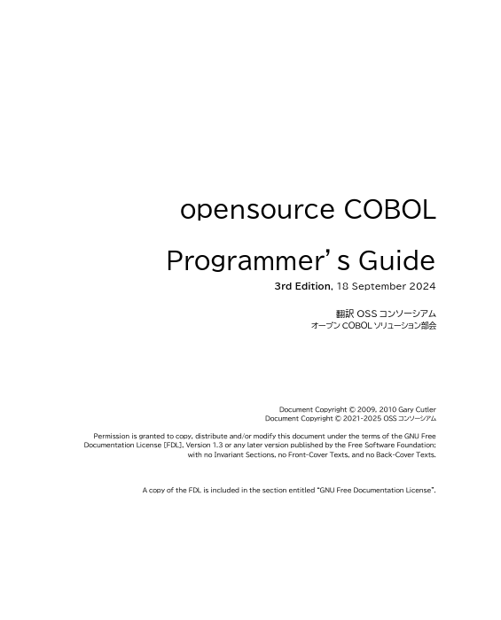

COBOL文法の完全日本語マニュアル『opensource COBOL Programmer's Guide』を公開しています。

- [PDF版](/guides/opensourceCOBOLProgrammersGuide.pdf)
- [HTML版](/markdown/TOC.md)

2021年より始動した本プロジェクトは、OSSコンソーシアム オープンCOBOLソリューション部会が活動の一環として、マニュアルの翻訳・執筆を進めています（プロジェクトリーダー：東京システムハウス 島田桃花）。

初版は原著をそのまま翻訳した内容です。第二版では、opensource COBOL で追加実装した日本語機能や新機能の説明を追加しました。
今後は、新製品である opensource COBOL 4J についての説明を追加していく予定です。

| PDF版 | HTML版 |
| --- | --- |
|  |  |

原著はGary Cultlerさんの[『OpenCOBOL Programmer's Guide』](https://gnucobol.sourceforge.io/guides/OpenCOBOL%20Programmers%20Guide.pdf)です。私たちの opensource COBOLのフォーク元である OpenCOBOLのCOBOL文法や使い方のマニュアルです。

ライセンスは、GNU Free Documentation License(FDL)です。日本語のCOBOLマニュアルがオープンソースのライセンスで公開されるのは業界初です。COBOL開発の現場での利用はもちろん、レガシー対策で一層需要が高まるCOBOLスキルの学習教材としても、自由にご利用いただけます。

## 改訂履歴
改訂履歴は[こちら](/markdown/history.md)です。

以上
