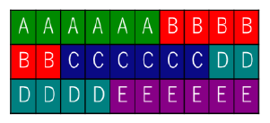

<!--navi start1-->
[前へ](1-2-3.md)/[目次](https://opensourcecobol.github.io/markdown/TOC.html)/[次へ](1-2-5.md)
<!--navi end1-->
### 1.2.4. ファイル

COBOLの主な強みの一つは、様々なファイルにアクセスできることである。opensource COBOLは、他のCOBOL実装と同様に、読み書きするファイルの構造を記述しておく必要がある。ファイル構造の最高レベルの特性は、次のように、ファイルの編成([4.2.1](4-2-1-1.md))を指定することによって定義される。

|||
|:---|:---|
|ORGANIZATION IS  LINE SEQUENTIAL|内部構造の中で最も単純なファイルであり、その内容は一連のデータレコードとして簡単に構造化され、特殊なレコード終了区切り文字で終了する。ASCII 改行文字(16進数の0A)は、UNIXまたは疑似UNIX(MinGW、Cygwin、MacOS)のopensource COBOLビルドで使用されるレコード終了区切り文字である。真のネイティブWindowsビルドでは、行頭復帰(CR)、改行(LF)(16進数の0D0A)順序が使用される。  ファイルタイプのレコードは、同じ長さである必要はない。  レコードは、純粋にファイルの先頭から順に読み書きする必要がある。レコード番号100を読み取る(または書き込む)唯一の方法は、最初にレコード番号1から99を読み取る(または書き込む)ことである。  opensource COBOLプログラムによってファイルに書き込まれるとき、区切り文字順序が各データレコードに自動的に追加される。  ファイルが読み取られるとき、opensource COBOLランタイムシステムは各レコードから末尾の区切り文字順序を削除し、読み取ったデータがプログラム内のデータレコード用に記述された領域よりも短い場合、必要に応じて、データ(の右側)を空白で埋める。データが長すぎる場合は切り捨てられ、超過分は消失する。  これらのファイルは、正確なバイナリデータ項目を含むように定義してはならない。これらの項目の内容の値の一部として、誤ってレコード終了順序が含まれる可能性があるためである。これは、ファイル読み取り時にランタイムシステムを混乱させ、その値を実際のレコード終了順序として解釈してしまう。|
ORGANIZATION IS RECORD BINARY SEQUENTIAL|これらのファイルも単純な内部構造を持っており、内容も一連の固定長データレコードとして簡単に構化されており、特別なレコード終了区切り文字はない。  このファイルタイプのレコードは、物理的な長さがすべて同じである。可変長論理レコードがプログラムに定義されている場合([5.3](5-3.md))、ファイル内の各物理レコードが占有する空白は、占有可能な最大である。  レコードは、純粋にファイルの先頭から順に読み書きする必要がある。レコード番号100を読み取る(または書き込む)唯一の方法は、最初にレコード番号1から99を読み取る(または書き込む)ことである。  ファイルがopensource COBOLプログラムによって書き込まれる場合、区切り文字順序はデータに追加されない  ファイルが読み取られると、データはファイルに存在する通りにプログラムに転送される。短いレコードが最後のレコードとして読み取られる場合は空白が埋め込まれる。  このようなファイルを読み取るプログラムは、そのファイルを作成したプログラムが使用する長さとまったく同じ長さのレコードを記述するよう注意しなければならない。例えば、次の例は6文字のレコードを5つ書き込んだプログラムによって作成されたRECORD BINARY SEQUENTIALファイルの内容を示している。「A」、「B」、･･･の値と背景色は、ファイルに書き込まれたレコードを反映している。   ここで、別のプログラムがこのファイルを読み取るが、6文字ではなく10文字のレコードが記述されているとする。プログラムが読み取るレコードは次の通りである。    これはあなたが求めていた結果かもしれないが、多くの場合でこれは望ましい動作ではない。これは、コピーブックを使用してファイルのレコードレイアウトを記述することで、そのファイルにアクセスする複数のプログラムが同じレコードサイズとレイアウトを「参照する」ことが保証される。  これらのファイルには、正確なバイナリデータ項目を含めることができる。レコード終了区切り文字がないため、レコード項目の内容は読み取りプロセスとは無関係である。  |
ORGANIZATION IS RELATIVE|ファイルの内容は、4バイトのUSAGE COMP-5([表5-10](5-3.md))レコードヘッダーで始まる一連の固定長データレコードで構成される。レコードヘッダーにはデータの長さがバイト単位で含まれるが、バイト数には4バイトのレコードヘッダーは含まれない。  このファイルタイプのレコードは、物理的な長さがすべて同じである。可変長論理レコードがプログラムに定義されている場合([5.3](5-3.md))、ファイル内の各物理レコードが占有する空白は、占有可能な最大である。  このファイル構成は、順次処理またはランダム処理に対応するように定義されている。相対ファイルを使用すると、最初にレコード1から99を読み書きする必要はなく、レコード100を直接読み書きできる。opensource COBOLランタイムシステムは、プログラムで定義された最大レコードサイズを使用して、レコードヘッダーとデータが開始するファイル内の相対バイト位置を計算し、必要なデータをプログラムとの間で転送する。  ファイルがopensource COBOLプログラムによって書き込まれる場合、区切り文字順序はデータに追加されないが、各物理レコードの先頭にレコード長項目が追加される。  ファイルが読み取られると、データはファイルに存在する通りにプログラムに転送される。  このようなファイルを読み取るプログラムは、そのファイルを作成したプログラムが使用する長さとまったく同じ長さのレコードを記述するよう注意しなければならない。ファイルからプログラムにデータを転送するときに、opensource COBOLランタイムライブラリが4バイトのASCII文字列をレコード長として解釈してしまうと、問題となる場合がある。  これは、コピーブックを使用してファイルのレコードレイアウトを記述することで、そのファイルにアクセスする複数のプログラムが同じレコードサイズとレイアウトを「参照する」ことが保証される。  これらのファイルには、正確なバイナリデータ項目を含めることができる。レコード終了区切り文字がないため、レコード項目の内容は読み取りプロセスとは無関係である。  |
ORGANIZATION IS INDEXED|opensource COBOLプログラムで使用できる最も高度なファイル構造である。使用するopensource COBOLビルドに含まれている高度なファイル管理機能(Berkeley DB[BDB]、VBISAMなど)によって構造が異なるため、ファイルの物理構造を説明することはできない。代わりに、ファイルの論理構造について説明する。  索引ファイルには複数の構造が格納される。一つ目は、相対ファイルの内部構造に似ていると考えられるデータ構成要素である。ただし、データレコードは相対ファイルのように、レコード番号で直接アクセスすることも、ファイル内の物理的な順序で順次処理することもできない。  残りの構造は、1つ以上の索引構成要素となり、これは(どうにかして)各データレコード内の主キーと呼ばれる項目内容(お客様番号、従業員番号、商品コード、氏名等)をレコード番号に変換するデータ構造である。これにより、特定の主キー値のデータレコードを直接読み取り、書き込み、削除することができる。更に、索引データ構造は、主キー項目値の昇順でファイルをレコードごとに順次処理できるように定義されている。構造の動作については説明した通りで、この索引構造がバイナリ検索可能なツリー構造(btree)として存在するか、精巧なハッシュ構造であるかどうか、プログラマには関係ない。ランタイムシステムは、同じ主キー値を持つ2つのレコードを索引付きファイルに書き込むことを許可しない。  追加項目を代替キーとして定義する機能がある。一つの例外を除いて、代替キー項目は主キーと同じように動作し、代替キー項目値に基づいてレコードデータへの直接アクセスと順次アクセスの両方を許可する。その例外とは、代替キー項目がopensource COBOLコンパイラにどのように記述されるかによって、代替キーが重複する値を持つことができる可能性があるということである([4.2.1.3](4-2-1-3.md))。  代替キーの数に制限はないが、各キー項目にはディスク容量と実行時間の制限が伴う。代替キー項目の数が増えると、ファイル内のレコードの書き込みや修正にかかる時間が更に長くなる。  これらのファイルには、正確なバイナリデータ項目を含めることができる。レコード終了区切り文字がないため、レコード項目の内容は読み取りプロセスとは無関係である。  |

すべてのファイルは、環境部の入出力節のファイル管理段落でコーディングされたSELECT文([4.2.1](4-2-1-1.md#421-ファイル管理段落))を使用して、最初にopensource COBOLプログラムに記述される。SELECT文では、プログラム内で参照されるファイル名を定義することに加えて、ファイル編成、ロック([6.1.8.2](6-1-8-2.md))と共有([6.1.8.1](6-1-8-1.md#6181-ファイル共有))オプションも一緒に、オペレーティングシステムに認識される名前とパスを指定する。

データ部の作業場所節のファイル節にあるファイル記述([5.1](5-1.md#51-ファイル記述))は、可変長レコードが可能かどうか―可能な場合―最小長と最大長はどのくらいか、ということを含むファイル内のレコードの構造を定義する。更に、ファイル記述項は、ファイル入出力のブロックサイズを指定できる。

<!--navi start2-->

[ページトップへ](1-2-4.md)
<!--navi end2-->
