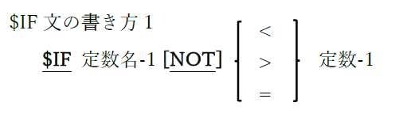
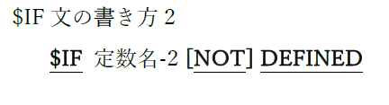

<!--navi start1-->
[前へ](1-3.md)/[目次](https://opensourcecobol.github.io/markdown/TOC.html)/[次へ](1-5.md)
<!--navi end1-->
## 1.4. ソースコードの形式

従来のCOBOLプログラムソースコードは、固定形式の80文字(最大)行を使用してコーディングしていたが、ANSI 2002規格では自由形式が定義されており、ソースコードの長さは最大256文字で、特定桁に固定の意味の割り当てはない。

opensource COBOLには、入力ファイルのソースコード形式を指定する、次の四つの方法がある。

| | |
| :--- | :--- |
| -fixed | このopensource COBOLコンパイラスイッチは、ソースコード入力が従来の固定形式(80桁)になることを指定し、これが初期モードである。 |
| -free | このopensource COBOLコンパイラスイッチは、ソースコード入力がANSI2002の自由形式(256桁)になることを指定する。 |
| \>\><u>SOURCE</u> FORMAT IS <u>FREE</u> | このソース行は、opensource COBOLコンパイラが検出すると、コンパイラは自由書式を受け付ける。「\>\>」文字は、8桁目以降で開始する必要がある。これと次の命令を使用することで、コンパイラを自由モードと固定モード間で自由に切り替えることができる。 |
| \>\><u>SOURCE</u> FORMAT IS <u>FIXED</u> | このソース行は、opensource COBOLコンパイラが検出すると、コンパイラは固定書式を受け付ける。これと前の命令を使用することで、コンパイラを自由モードと固定モード間で自由に切り替えることができる。 |

以下のものは、opensource COBOLプログラムで様々なことを示すために使う、特別な命令または文字である。

| | |
| :--- | :--- |
| 7桁目の「*」 | ソース行がコメントであることを示し、固定形式モードの場合のみ有効である。 |
| 7桁目の「D」 | ソース行が有効なopensource COBOLコードであり、opensource COBOLコンパイラに「–fdebugging-line」スイッチが指定されて<u>いない限り</u>(その場合、行はコンパイルされる)コメントであることを示す。固定形式モードの場合のみ有効である。 |
| 7桁目の「$IF」 | ソース行が有効なopensource COBOLコードであり、opensource COBOLコンパイラに「–fdebugging-line」スイッチが指定されて<u>いない限り</u>(その場合、行はコンパイルされる)コメントであることを示す。固定形式モードの場合のみ有効である。 |
| 7桁目の「$IF」 |  定数名-1がコンパイルオプション「-constant」で指定されており、定数-1の値が定数名-1の値に等しい時、または定数名-1の値の範囲内にある時、$IF文以降に続くソース行の処理が実行される。   定数名-2がコンパイルオプション「-constant」で指定されている時、DEFINED句は真となり、$IF文以降に続くソース行の処理が実行される。それ以外の場合はNOT DEFINED句が真となり、$IF文以降に続くソース行の処理が実行される。 |
| 7桁目の「$ELSE」 | 直前の$IF文の条件式が偽である時、$ELSE文に制御が移り、$ELSE文以降に続くソース行の処理が実行される。直前の$IF文の条件式が真である時、$ELSE文は無視される。 |
| 7桁目の「$END」 | $END文と同じレベルにある$IF文または$ELSE文に続くソース行の処理の実行が終了すると、$ENDに制御が移り、$IF文または$ELSE文の終了を示す。 |
| 任意の桁の「*>」 | ソース行の残りの部分がコメントであることを示す。自由形式モードと固定形式モードのどちらでも使用できるが、固定形式モードで使用する場合は、「*」を7桁目以降に入力する必要がある。 |
| 任意の桁の「\>\>D」 | ソース行が有効なopensource COBOLコードであり、opensource COBOLコンパイラに「**–fdebugging-line**」スイッチが指定されて<u>いない限り</u>(その場合、行はコンパイルされる)コメントであることを示す。固定形式モードと自由形式モードのどちらの場合でも有効である。自由形式モードではどの桁からでも開始できるが、固定形式モードでは、8桁目以降から開始しなければならない。 |

<!--navi start2-->

[ページトップへ](1-4.md)
<!--navi end2-->
