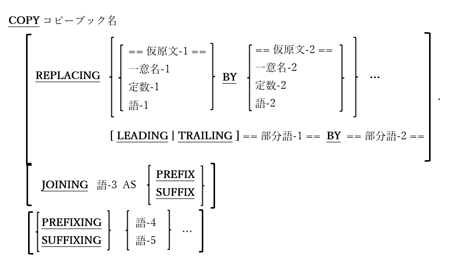

<!--navi start1-->
[前へ](1-5.md)/[目次](https://opensourcecobol.github.io/markdown/TOC.html)/[次へ](1-7-1.md)
<!--navi end1-->
## 1.6. COPY文の使い方

図1-2-COPY構文

COPY文は、プログラムにコピーブック([1.2.2](1-2-2.md))をインポートするために使われる。

1. opensource COBOLは、コピーブックの使用を完全にサポートしている。コピーブックとは、COPY文も入れた<u><b><i>全てのCOBOL構文</i></b></u>を含む個別のソースファイルのことである。

2. COPY文は、コピーブックに含まれるコードが構文的に有効であるCOBOLプログラム内のどこでも使用できる。

3. 上記の構文図では、COPY文の最後のピリオドと、REPLACING句を強調している。経験のあるCOBOLプログラマの目には、ピリオドが<u>あるべきではない</u>と思われる場合でも、全てのCOPY文の最後にはピリオドが<u>絶対に必須である</u>。

4. コンパイルプロセスが開始される前に、全てのCOPY文が決定され、対応するコピーブックの内容がプログラムのソースコードに挿入される。

5. オプションのREPLACING句を使用すると、予約語(語-1、語-2)、データ項目(一意名-1、一意名-2)、定数(定数-1、定数-2)、または空白で区切られたフレーズを置き換えることができる。コピーブックがプログラムに含まれているため、何度でも置換を行うことができる。

6. オプションのREPLACING句の使用時にLEADINGおよびTRAILINGを指定すると、予約語またはユーザ定義語の先頭(LEADINGを参照)または末尾(TRAILINGを参照)にある文字順序を置き換えることができる。例えば、「0100-xxxxxx」の単語を「020-xxxxxx」に変換するには、LEADING ==0100-== BY ==020-== とコーディングする。「0100-」の単語を削除するには、LEADING ==0100-== BY ==== とコーディングする。

7. オプションのJOINING句の使用時にPREFIXを指定すると、コピーブックで定義されているデータ名、条件名、定数名の前に語-3とハイフン「**–**」が付けられる。

8. オプションのJOINING句の使用時にSUFFIXを指定すると、コピーブックで定義されているデータ名、条件名、定数名の後ろにハイフン「**–**」と語-3が付けられる。

9. オプションのPREFIXING句を使用すると、コピーブックで定義されているデータ名、条件名、定数名の前に語-4が付けられる。

10. オプションのSUFFIXING句を使用すると、コピーブックで定義されているデータ名、条件名、定数名の後ろに語-5が付けられる。

11. プログラムのコンパイル時にopensource COBOLコンパイラがコピーブックを見つける方法の詳細については、「[8.1.8](8-1-8.md) コンパイル時のコピーブックの検索」で説明する。

<!--navi start2-->

[ページトップへ](1-6.md)
<!--navi end2-->
