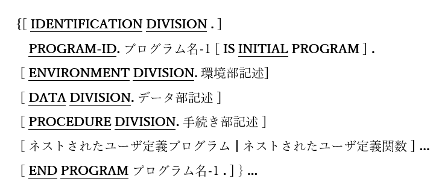
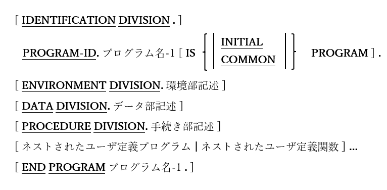

<!--navi start1-->
[前へ](1-10.md)/[目次](https://opensourcecobol.github.io/markdown/TOC.html)/[次へ](2-2.md)
<!--navi end1-->
# 2. opensource COBOLのプログラム形式

図2-1-opensource COBOLのプログラム形式

COBOLプログラムは、共通の目的に関連する言語文が主要なグループごとに分けられ、区分として編成されている。

すべてのプログラムにおいて区分けが必要なわけではないが、使用時に示されている順序で指定する必要がある。

1. opensource COBOLコンパイラは、ソースコード(コンパイルユニット)を単一の実行可能プログラムにコンパイルします。このソースコードは、単一のプログラム(プログラムに必要な区分によって定義され、後ろにオプションのEND PROGRAM句が続くソースコード順序)、または必須の区分とEND PROGRAM句で構成される複数のプログラムである。複数のプログラムが単一のコンパイルユニットでコンパイルされている場合、最後のプログラムにEND PROGRAM句を含める必要はないが、それ以外のプログラムには一つは必要である。

2. opensource COBOLコンパイラに複数の入力ファイルを指定すると、指定ファイルの内容で構成されたコンパイルユニットが定義され、指定された順序でコンパイルされる。効果は、複数のプログラムを含む単一のソースファイルがコンパイルされた場合と同じであるが、複数のプログラムが含まれていない限り、個々のソースファイルにEND PROGRAM句を含める必要はない。

3. 単一のコンパイルユニットを構成するプログラムの数に関係なく、単一の出力実行可能プログラムのみ生成される。コンパイルユニットで最初に検出されたプログラムがメインプログラムとして機能し、それ以外のプログラムは、メインプログラムまたは他のプログラムによって順番に呼び出されるサブプログラムとして機能する。

4. 各区分の目的の概要は次の通りである：

| 区分 | 目的 |
| :--- | :--- |
| 見出し | プログラムID(プログラム名)を指定することにより、プログラムの基本認証を定義する([3章](3.md))。 |
| 環境 | プログラムが動作する外部計算機環境を定義する区域で、プログラムがアクセスする可能性のあるファイルの定義を含む([4章](4-1-1.md))。 |
| データ | プログラムが処理するすべてのデータを定義する([5章](5-1.md))。 |
| 手続き | すべての実行可能プログラムコードを含む([6章](6-1-1.md))。 |

## 2.1. ネストされたユーザプログラム

図2-2-ネストされたユーザプログラム

ネストされたユーザプログラムは、他のプログラム内に埋め込まれたプログラムである(これらは「親」プログラムの手続き区分に従い、間に介在するEND PROGRAMは存在しない)。そのため、埋め込まれている親プログラムでのみ使用可能なサブプログラムとして機能する`3`。

1. ネストされたユーザプログラム自体に、他のネストされたプログラムが含まれている場合がある。ネスト構造が「等しいレベル」であると考えられるネストされたサブプログラムの間にEND PROGRAM句を含めるよう注意しなければならない。

---

`3`もちろん、すべてのルールには常に例外が存在する。<!--26ページ-->PROGRAM-ID段落のCOMMON句で説明する。

<!--navi start2-->

[ページトップへ](2-1.md)
<!--navi end2-->
