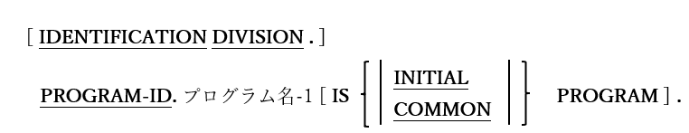

# 3. 見出し部

図3-1-見出し部構文

プログラムID(プログラム名)を指定することにより、プログラムの基本認証を定義する。
1. 見出し部(IDENTIFICATION DIVISION)のヘッダーはオプションであるが、PROGRAM-ID句はオプション<u>ではない。</u>

2. PROGRAM-ID句は他のプログラムが参照できるように(つまりCALL “program-name”)、名前(プログラム名)を定義する。

3. プログラム名は大文字と小文字を区別する。コンパイル単位が動的にロード可能なライブラリファイル(opensource COBOLコンパイラコマンドの「**-m**」オプションを使用するもの)として作成されている場合、コンパイラによって作成されたライブラリファイル名はプログラム名と<u>完全に一致</u>する。コンパイル単位が実行可能ファイル(opensource COBOLコンパイラコマンドの「**-x**」オプションを使用するもの)として作成されている場合、プログラムIDは有効なCOBOL一意名となり、実行可能ファイル名は、「cbl」または「cob」拡張子のないソースプログラムファイル名と同じになる。

4. INITIAL句とCOMMON句は、サブプログラム内で使用される。COMMON句はネストされたユーザプログラムであるサブプログラム内でのみ使うことができる。

5. INITIAL句を指定すると、サブプログラムは最初だけでなく実行される度に、初期(つまりコンパイル済み)状態が確保される。

6. COMMON句が存在している場合は、ネストされたユーザプログラム(サブプログラム)ユニットを、親プログラムだけでなく、その親に当たる他のネストされたユーザプログラムでも使用できるようにする。

7. 「–Wobsolete」コンパイルスイッチが使用されていない限り、DATE-WRITTEN、DATE-COMPILED、AUTHOR、INSTALLATION、SECURITY、REMARKSなどの廃止された見出し部記述項は、通常は無視される。このような場合、警告メッセージが生成されるがコンパイルは続行される。
