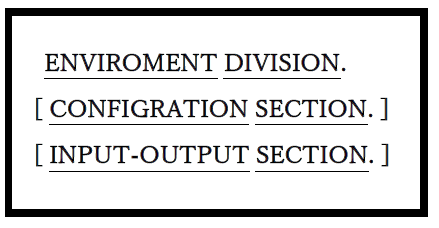
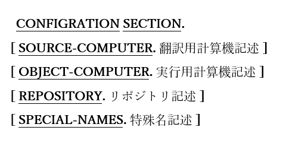
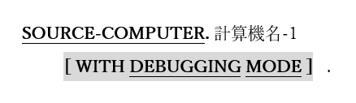

<!--navi start1-->
[前へ](3.md)/[目次](https://opensourcecobol.github.io/markdown/TOC.html)/[次へ](4-1-2.md)
<!--navi end1-->
# 4. 環境部

図4-1-環境部構文

プログラムが動作する外部計算機環境を定義する区域で、プログラムがアクセスする可能性のあるファイルの定義を含む。

1. 環境部(ENVIRONMENT DIVISION)によって定義できる機能のいずれもプログラムで必要としない場合は、この区域を指定する必要はない。

## 4.1. 構成節

図4-2-構成節構文

プログラムがコンパイルおよび実行される計算機システムを定義し、特殊な環境構成や互換性特性も指定する。

1. 構成節(CONFIGURATION DIVISION)の段落が指定される順序に関連性はない。

### 4.1.1. 翻訳用計算機段落

図4-3-翻訳用計算機段落構文

翻訳計算機(SOURCE-COMPUTER)段落は、プログラムがコンパイルされる計算機を定義する。

1. 計算機名-1に指定された値が、opensource COBOLの予約語とは一致しない有効なCOBOL語である場合、この値は定義と無関係である。

2. オプションのWITH DEBUGGING MODE句が存在する場合、廃止した構文としてフラグが付けられ(「**-W**」、「**-Wobsolete**」、または「**-Wall**」コンパイラスイッチを使う場合)、プログラムのコンパイルには影響しない。

3. ただし、opensource COBOLコンパイラへの「**-fdebugging-line**」スイッチを指定することで、プログラムのデバッグ行をコンパイルできる。opensource COBOLプログラムでデバッグ行を指定する方法については[1.4](1-4.md)で説明している。

<!--navi start2-->

[ページトップへ](4-1-1.md)
<!--navi end2-->
