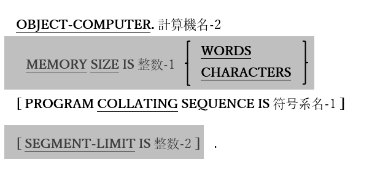

<!--navi start1-->
[前へ](4-1-1.md)/[目次](https://opensourcecobol.github.io/markdown/TOC.html)/[次へ](4-1-3.md)
<!--navi end1-->
### 4.1.2. 実行用計算機段落

図4-4-実行用計算機段落構文

実行用計算機(OBJECT-COMPUTER)段落は、プログラムが実行される計算機について説明する段落ではあるが、単なるドキュメントではない。

1. 計算機名-2に指定された値が、opensource COBOLの予約語とは一致しない有効なCOBOL語である場合、この値は定義と無関係である。

2. MEMORY SIZE句とSEGMENT-LIMIT句は互換性の目的でサポートされているが、opensource COBOLでは機能しない。

3. PROGRAM COLLATING SEQUENCE句を使用すると、英数字の値を相互に比較するときに用いる、カスタマイズされた文字の大小順序を指定できる。データは引き続き計算機に固有の文字セットに格納されるが、比較のために文字が並べ替えられる論理的な順序を計算機に固有の文字セットに変更できる。符号系名-1は、特殊名節([4.1.4](4-1-4.md))で定義する必要がある。

4. PROGRAM COLLATING SEQUENCE句が指定されていない場合、計算機に固有の文字セット(通常はASCII)によって暗示される大小順序が使用される。

<!--navi start2-->

[ページトップへ](4-1-2.md)
<!--navi end2-->
