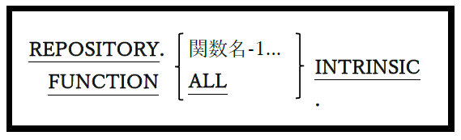

### 4.1.3. リポジトリ段落

図4-5-リポジトリ段落構文

リポジトリ(REPOSITORY)段落は、様々な組み込み関数へのアクセスを制御するためのメカニズムを定義する。

1. 関数名の前に「FUNCTION」とコーディングしなくても、一つ以上(またはすべて)の組み込み関数に使用可能とするフラグを立てることができる。組み込み関数については6.1.7で説明する。

2. この段落を使用する代わりに、「**-ffunctions-all**」スイッチを用いてopensource COBOLプログラムをコンパイルすることもできる。
