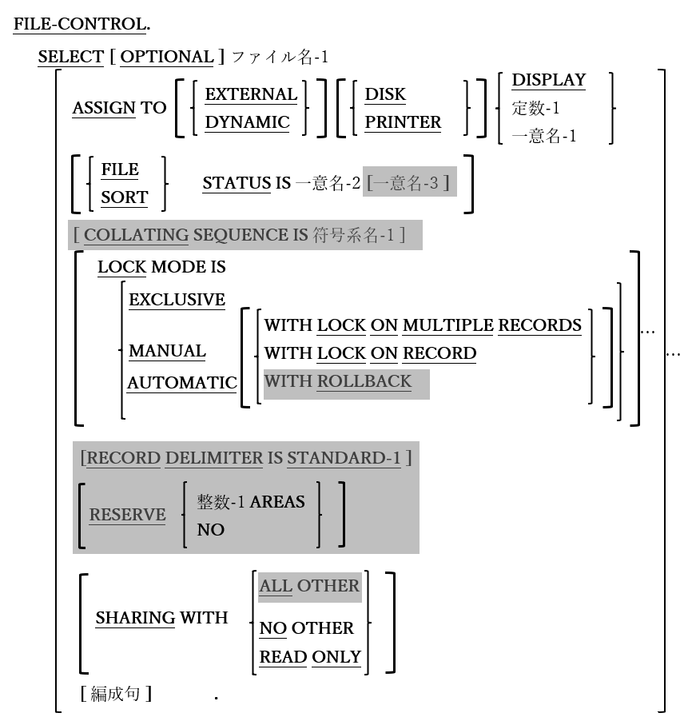

<!--navi start1-->
[前へ](4-1-4.md)/[目次](https://opensourcecobol.github.io/markdown/TOC.html)/[次へ](4-2-1-2.md)
<!--navi end1-->
## 4.2. 入出力節

図4-9-入出力節構文

入出力節(INPUT-OUTPUT SECTION)では、プログラムがアクセスするファイルを詳細に定義する。

1. 使用しているコンパイラの「config」ファイルの「relaxed-syntax-check」が「yes」に設定されている場合、入出力節のヘッダーを指定せずにファイル管理および入出力管理段落を指定することができる。構成ファイルやプログラムへの影響については[8.1.8](8-1-8.md)で説明する。

### 4.2.1. ファイル管理段落

図4-10-ファイル管理段落構文

ファイル管理(FILE-CONTROL)段落のSELECT文は、ファイル定義を作成し、外部オペレーティングシステム環境とリンクする。ここに示す例は、すべてのファイル形式に共通しているSELECT句である。次の節では、特定のファイル形式で用いる特別なSELECT句について説明する。

1. COLLATING SEQUENCE、RECORD DELIMITER、RESERVE、SHARING WITH ALL OTHER句、および二次FILE-STATUS項目とLOCK MODE ･･･ WITH ROLLBACKの指定は、構文的には認識されるが、opensource COBOLでは現在サポートされていない。

2. OPTIONAL句は、プログラムに入力データを渡すために用いられるファイルにのみ使用され、ファイルの実行時に使用可能であるかどうかを示す。ファイルが存在しないときにOPTIONALファイルを開こうとすると([6.31](6-31.md))、ファイルが使用できないことを示す、致命的ではないが特別なファイルステータス値(表4-11のステータスコード05を参照)を受け取る。その後にファイルを読み取ろうとすると([6.33](6-33-1.md))、ファイル終了条件が返される。

3. opensource COBOLコンパイラパーサーテーブルは、実際にやや不合理な文がコーディングされても正常に解析できる。

        SELECT My-File ASSIGN TO DISK DISPLAY.

    効果としては、PC画面に割り当てられたファイルを作成するためにコーディングされたものと同じ結果が得られる。

          SELECT My-File ASSIGN TO DISPLAY.

4. ASSIGN句で「定数-1」オプションを使用すると、COBOLファイルからオペレーティングシステムファイルへの外部リンクが次のように定義される。

    - 「DD_定数-1」という名前の環境変数が存在する場合、その値はファイルのフルパスまたはファイル名として扱われる。そうでない場合は次へ。

    - 「dd_定数-1」という名前の環境変数が存在する場合、その値はファイルのフルパスまたはファイル名として扱われる。そうでない場合は次へ。

    - 「定数-1」という名前の環境変数が存在する場合、その値はファイルのフルパスまたはファイル名として扱われる。そうでない場合は次へ。

    - 定数自体が、ファイルへのフルパスまたはファイル名として扱われる。

    この動作は、プログラムのコンパイル時に用いる構成ファイルの「filename-mapping」設定の影響を受ける。上記の動作は、「filename-mapping：yes」が有効な場合にのみ適用され、「filename-mapping：no」に設定すると、最後のオプション(定数自体をフルファイル名として扱う)のみが可能となる。構成ファイルやプログラムへの影響については[8.1.8](8-1-8.md)で説明する。

    一意名-2のPICTURE(FILE STATUS句)は9(2)でなければならない。入出力ステータスコードは、ファイルに対して実行されるすべての入出力文の後に、この一意名に保存される。以下が、考えられるステータスコードの一覧である。

    表4-11-ステータスコード

    |ステータス値 | 意味  |
     | :---: | :--- |
     |00 | 成功|
     |02 | 成功(重複レコードキーが検出された)|
     |05 | 成功(オプションファイルが存在しない)|
     |07 | 成功(ユニットが存在しない)|
     |10 |ファイル終了|
     |14 |キー範囲外|
     |21 |キーが無効である|
     |22 |キーの値の重複が検出された|
     |23 |キーが存在しない|
     |30 |永続的入出力エラー|
     |31 |ファイル名に一貫性がない|
     |34 |ファイル区域外である|
     |35 |ファイルが存在しない|
     |37 |アクセス権拒否|
     |38 |ファイルがロックで閉じられている|
     |39 |属性の矛盾が検出された|
     |41 |ファイルが既に開かれている|
     |42 |ファイルが開かれていない|
     |43 |読み込みが行われていない|
     |44 |レコードのオーバーフロー|
     |46 |読み込みエラー|
     |47 |OPEN INPUTが拒否された|
     |48 |OPEN OUTPUTが拒否された|
     |49 |OPEN I/Oが拒否された|
     |51 |レコードがロックされている|
     |52 |ページ終了|
     |57 |LINAGE指定が無効である|
     |61 |ファイル共有の失敗|
     |91 |ファイルが利用できない|

5. LOCK句とSHARING句は、このファイルと同時に実行されている他のプログラムも、ファイルを使用できる条件を定義する。ファイルのロックと共有については、[6.1.8](6-1-8-1.md)で説明する。

#### 4.2.1.1. 順編成ファイル

図4-12-順編成ファイルの指定

SEQUENTIALファイルとは、ファイル内のデータを順次処理することしかできない内部構造(COBOLでは編成と呼ばれる)を持つファイルである。ファイルの100番目のレコードを読み取るには、レコードの1から始めて99までを読み取る必要がある。

1. ORGANIZATION RECORD BINARY SEQUENTIALとして宣言されたファイルは、明示的なレコード終了区切り文字順序のないレコードで構成される。ファイル内のレコードは、(レコード長に基づいて)計算されたバイトオフセットによって、ファイルに「書き出し」される。ファイルにはプログラムに区切り文字が埋め込まれているため、標準のテキスト編集ソフトウェアやワードプロセッシングソフトウェアでは作成できない。このようなファイルには、USAGE DISPLAYまたはUSAGE COMPUTATIONAL(種類は任意である)のデータが含まれている可能性があり、これは文字順序がレコード終了の区切り文字として解釈されないためである。

2. ORGANIZATION IS RECORD BINARY SEQUENTIALの指定と、ORGANIZATION SEQUENTIALの指定は同じである。

3. ORGANIZATION LINE SEQUENTIALとして宣言されたファイルは、ASCII改行文字(X"10")で終了するレコードで構成される。LINE SEQUENTIALファイルを読み取る場合、ファイルのFDで示されるサイズを超えた分のレコードは切り捨てられ、そのサイズより短いレコードは右側がPADDING CHARACTER値によって埋められる。

4. PADDING CHARACTERが指定されていない場合はSPACEが指定されたものとみなす。

5. PADDING CHARACTER句は、すべてのORGANIZATIONファイルで構文的には受け入れられるが、LINE SEQUENTIALファイルがレコードを埋めることができる唯一のファイルであるため意味を持つ。

6. 固定長と可変長、両方のレコード形式がサポートされている。

7. PRINTERまたはCONSOLEにASSIGNされたファイルは、ORGANIZATION LINE SEQUENTIALとして指定する必要がある。

8. SEQUENTIALファイルの処理に関する文については、CLOSE([6.9](6-9.md))、COMMIT([6.10](6-10.md))、DELETE([6.13](6-13.md))、MERGE([6.27](6-27.md))、OPEN([6.31](6-31.md))、READ([6.33](6-33-1.md))、REWRITE([6.36](6-36.md))、SORT([6.40.1](6-40-1.md))、UNLOCK([6.48](6-48.md))およびWRITE([6.50](6-50.md))で説明する。

<!--navi start2-->

[ページトップへ](4-2-1-1.md)
<!--navi end2-->
