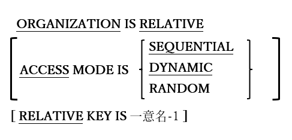

<!--navi start1-->
[前へ](4-2-1-1.md)/[目次](https://opensourcecobol.github.io/markdown/TOC.html)/[次へ](4-2-1-3.md)
<!--navi end1-->
#### 4.2.1.2. 相対編成ファイル

図4-13-相対編成ファイルの指定

RELATIVEファイルは、レコードを順次またはランダムに処理できる内部編成を持つファイルであり、ファイル内の相対レコード番号を指定することによって、レコードの読み取り、書き込み、および更新を行うことができる。

1. ORGANIZATION RELATIVEファイルをCONSOLEまたはPRINTERに割り当てることはできない。

2. RELATIVE KEY句は、ACCESS MODE SEQUENTIALが指定されている場合のみオプションとして扱う。

3. ORGANIZATION RELATIVEファイルのレコードは可変長レコードを持つものとして定義できると<u>考えられる</u>が、ファイルは各レコードに対して最大レコード長を確保するように構造化される。

4. SEQUENTIALのACCESS MODEではファイルのレコードが順次処理され、RANDOMのACCESS MODEではレコードがランダムに処理される。DYNAMIC ACCESS MODEでは、ファイルがRANDOMまたはSEQUENTIALモードのいずれかで処理され、プログラムの実行時に二つのどちらかを切り替えることができる([6.41](6-41.md)のSTART文を参照)。

5. ACCESS MODEが指定されていない場合はSEQUENTIALが指定されたものとみなす。

6. RELATIVE KEYデータ項目は、ファイルのレコード内項目にできない数値データ項目である。SEQUENTIALアクセスモードで処理されているRELATIVEファイルの現在の相対レコード番号を返し、RANDOMアクセスモードでRELATIVEファイルを処理するときに、読み取りまたは書き込みされる相対レコード番号を指定する検索キーとなる。

7. RELATIVEファイルの処理に関する文については、CLOSE([6.9](6-9.md))、COMMIT([6.10](6-10.md))、DELETE([6.13](6-13.md))、MERGE([6.27](6-27.md))、OPEN([6.31](6-31.md))、READ([6.33](6-33-1.md))、REWRITE([6.36](6-36.md))、SORT([6.40.1](6-40-1.md))、START([6.41](6-41.md))、UNLOCK([6.48](6-48.md))およびWRITE([6.50](6-50.md))で説明する。

<!--navi start2-->

[ページトップへ](4-2-1-2.md)
<!--navi end2-->
