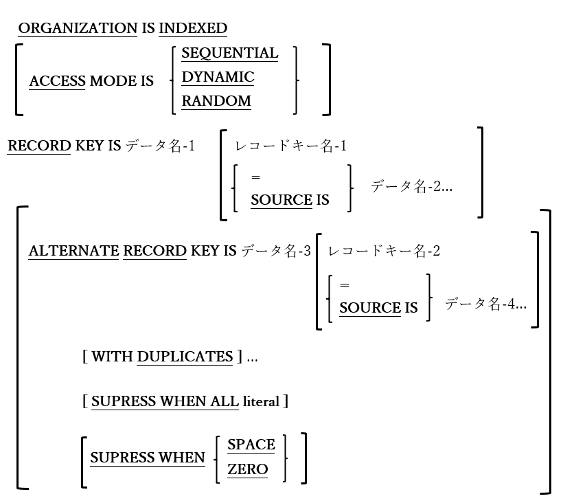

<!--navi start1-->
[前へ](4-2-1-2.md)/[目次](https://opensourcecobol.github.io/markdown/TOC.html)/[次へ](4-2-2.md)
<!--navi end1-->
#### 4.2.1.3. 索引編成ファイル

図4-14-索引編成ファイルの指定

RELATIVEファイルのようなINDEXEDファイルでは、レコードが順次またはランダムに処理される場合がある。ただしRELATIVEファイルとは異なり、INDEXEDファイル内のレコードの実際の位置は、レコード内の一つ以上の英数字項目値に基づいている。

例えば、製品データを含むINDEXEDファイルは、製品識別コードをキーとして用いる場合がある。つまり、「A6G4328」番目のレコードまたは「Z8X7723」番目のレコードの製品IDの値に基づいて、直接レコードを読み取り、書き込み、または更新することができる。

1. SEQUENTIALのACCESS MODEでは、ファイルのレコードがRECORD KEYまたはALTERNATE RECORD KEYの値によって順次処理され、RANDOMのACCESS MODEではレコードがキー項目内でランダムに処理される。DYNAMIC ACCESS MODEでは、ファイルがRANDOMまたはSEQUENTIALモードのいずれかで処理され、プログラムの実行時に二つのどちらかを切り替えることができる([6.41](6-41.md)のSTART文を参照)。

2. ACCESS MODEが指定されていない場合はSEQUENTIALが指定されたものとみなす。

3. RECORD KEY句は、ファイル内レコードへ一次アクセスするために用いるレコード内の項目を定義する。この時、ファイル内の2つのレコードが同じPRIMARY KEY項目値を持つことは許可されない。SOURCE IS句は、分割キーで使用する。

4. ALTERNATE RECORD KEY句では、レコードに直接アクセスするための代替手段となるレコード内の追加項目、またはファイルの内容を順次処理できる追加項目を定義する。必要であれば、レコードに対して重複する代替キー値を許可することもできる。

5. 複数のALTERNATE RECORD KEY句があり、それぞれがファイルの代替キーを追加で定義している場合がある。

6. RECORD KEY値はすべてのレコードにおいて一意でなければならない。ファイル内レコードのALTERNATE RECORD KEY値は、代替キーにWITH DUPLICATES句が指定されている場合にのみ、重複する値を持つことが可能となる。

7. INDEXEDファイルの処理に関する文については、CLOSE([6.9](6-9.md))、COMMIT([6.10](6-10.md))、DELETE([6.13](6-13.md))、MERGE([6.27](6-27.md))、OPEN([6.31](6-31.md))、READ([6.33](6-33-1.md))、REWRITE([6.36](6-36.md))、SORT([6.40.1](6-40-1.md))、START ([6.41](6-41.md))、UNLOCK([6.48](6-48.md))およびWRITE([6.50](6-50.md))で説明する。

<!--navi start2-->

[ページトップへ](4-2-1-3.md)
<!--navi end2-->
