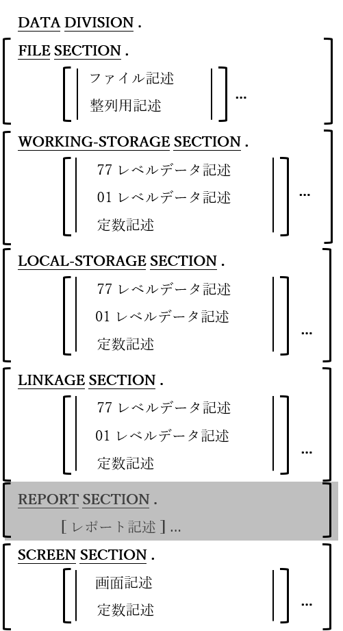

<!--navi start1-->
[前へ](4-2-2.md)/[目次](https://opensourcecobol.github.io/markdown/TOC.html)/[次へ](5-2.md)
<!--navi end1-->
# 5. データ部

図5-1-データ部の形式

データ部(DATA DIVISION)は、プログラムが処理するすべてのデータを定義するために利用される。データ型やデータの使用方法に応じて、上に示した構文の骨組みからもわかるように、一つの節ごとに定義されている。

1. 宣言されているどの節も、提示されている順序で指定する必要がある。データ部が必要でない場合は、ヘッダー自体を省略することができる。

2. レポート節(REPORT SECTION)は構文的には認識されるが、利用すると対応されていないものとして拒否されてしまう。opensource COBOLはRWCS(レポート作成制御システム)に対応していないためである。(ただし、ファイル記述項ではLINAGE句がサポートされている。)

3. 局所場所節(LOCAL-STORAGE SECTION)は作業場所節(WORKING-STORAGE SECTION)と同じ方法で使用されるが、一つだけ例外がある。局所場所節で定義されたデータは、プログラム(ほとんどがサブプログラム)が実行される度に、初期状態に〔再〕初期化される。一方で、作業場所節のデータは静的であり、プログラムが中断されるか、メインプログラムの実行が終了するまで、最後に利用していた状態が保たれる。

4. 局所場所はネストされたプログラムでは使用できない。

5. 画面節(SCREEN SECTION)ではレポートの構造をレイアウトするレポート節を使う時と同様の規則や構文を使ったテキストベースでの画面レイアウトを定義できる。

6. opensource COBOLには共通場所節(COMMON-STORAGE SECTION)がないことに注意が必要である。実際に、この特徴はCOBOL規格から削除された。ただし機能的には、EXTERNALまたはGLOBALデータ項目属性に置き換えられている。

## 5.1. ファイル記述

図5-2-ファイル記述構文

プログラム内のSELECTで指定されたすべてのファイルについて詳細な記述が必要で、ファイル節(FILE SECTION)でコード化される。記述方法には、ファイル記述(FD)と整列用記述(SD)があり、それぞれ通常のデータファイルの記述と、作業ファイルの整列に使用される。ファイル記述では、ファイルで使用されるレコード形式と、それらのレコードが効率的に処理を行うように、物理的ブロックに「まとめる」方法について詳細に説明する。

1. CODE-SET句では、構文的に認識されているが、opensource COBOLでは現時点でサポートされていない。

2. LABEL RECORD句、DATA RECORD句、RECORDING MODE句、およびVALUE OF句は使われなくなった。使用しても生成されたコードに影響はない。DATA RECORD句で指定された一意名はプログラム内で定義されているが、コンパイラの方は一意名が実際にファイルのレコードとして指定されているかどうかは問題にしない。

3. COBOL言語は複数ある論理データレコードを、単体の物理データレコードに「ブロック」として入れることができる。メモリブロックが新しいレコードでいっぱいになった時、順次処理される出力ファイルに対して、実際に物理的書き込みが行われる([6.10](6-10.md)のCOMMIT文を参照)。同様にファイルを連続して読み取る場合、ファイルに対して生成された最初のREAD文は、最初の物理レコード(ブロック)を取得し、そこから最初の論理レコードが取得され、プログラムに送られる。次に生成されたREAD文は、バッファーが使い果たされるまで連続する論理コードを取得し、使い果たされると、次の物理レコードの取得のために別の物理的読み取りが実行される。ファイル記述のBLOCK CONTAINS句を使用すると、プログラマに対して<u>完全に透過的な</u>方法ですべての処理を実行できる。

4. LINE SEQUENTIALファイルを使用する場合、RECORD CONTAINS句とRECORD IS VARYING句は無視される(警告メッセージが表示される)。他のファイル編成において、これらのような相互に排他的な句は、ファイル内のデータレコードの長さを定義していて、その長さはブロックのサイズを計算するためにBLOCK CONTAINS ･･･ RECORDS句によって使用される。

5. REPORT IS句は構文的に認識されているが、RWCSはopensource COBOLでは現時点でサポートされていないため、エラーが発生する。

6. LINAGE句は、ORGANIZATION RECORD BINARY SEQUENTIAまたはORGANIZATION LINE SEQUENTIALファイルのみ指定できる。ORGANIZATION RECORD SEQUENTIALファイルで使用される場合、ファイル定義は暗黙的にLINE SEQUENTIALに変更される。

7. LINAGE句は図5-3からわかるように、印刷ページの様々な領域の論理的な境界線を(行数の観点から)指定するために使用される。このページ構造の利用方法については、[6.50](6-50.md)(WRITE文)で説明する。

    図5-3-LINAGE句指定ページ構造

    

8. EXTERNAL句を指定することにより、ファイル記述が必要な各コンパイルユニットで(EXTERNAL句を使って)記述されている場合、ファイル記述は、特定の実行スレッド内のすべてのプログラム(個別にコンパイルされるか、同じコンパイルユニットでコンパイルされる)間で共有できる。この共有によって、異なる様々なプログラムでファイルをOPEN、読み書き、CLOSEすることができる。

9. GLOBAL句を指定することにより、ファイル記述が必要な各プログラムで(GLOBAL句を使って)記述されている場合、ファイル記述は、特定の実行スレッド内の同じコンパイルユニットにあるすべてのプログラム間で共有できる。この共有によって、異なる様々なプログラムでファイルをOPEN、読み書き、CLOSEすることができるが、個別にコンパイルされたプログラムは、GLOBALファイル記述を共有できない(ただしEXTERNALファイル記述は共有できる)。

<!--navi start2-->

[ページトップへ](5-1.md)
<!--navi end2-->
