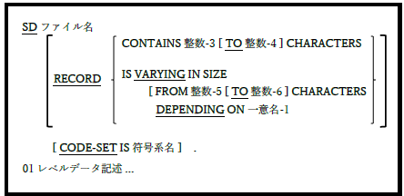

<!--navi start1-->
[前へ](5-1.md)/[目次](https://opensourcecobol.github.io/markdown/TOC.html)/[次へ](5-3.md)
<!--navi end1-->
## 5.2. 整列用記述

図5-4-整列用記述段落

整列用ファイル([6.27](6-27.md)および[6.40.1](6-40-1.md)を参照)はファイル記述ではなく、整列用記述を使って説明する。

1. 完全な「ファイル記述(FD)」構文は実際には整列の記述に使用できるが、ここに示される構文要素のみ意味を持つことになる。

2. 整列用ファイルをディスクに割り当てる必要がある。

3. 整列されるデータの量が許容される場合、整列はメモリ内で実行される。

4. 一方でデータ量の確保にディスク作業ファイルが必要な場合、TMPDIR、TMP、またはTEMP環境変数で定義されたフォルダ内のディスクに自動で割り当てられる([8.2.4](8-2-4.md)を参照)。これらのディスクファイルは、プログラムの実行が(通常またはその他の方法で)終了した場合、自動で削除されない。一時的な整列用作業ファイルは、自分自身から、または整列が終了した自分のプログラムから、ファイルを削除したい場合に「cob*.tmp」と命名される。

5. 整列用ファイルのSELECT文で特定のファイル名を指定すると、そのファイル名は無視される。

<!--navi start2-->

[ページトップへ](5-2.md)
<!--navi end2-->
