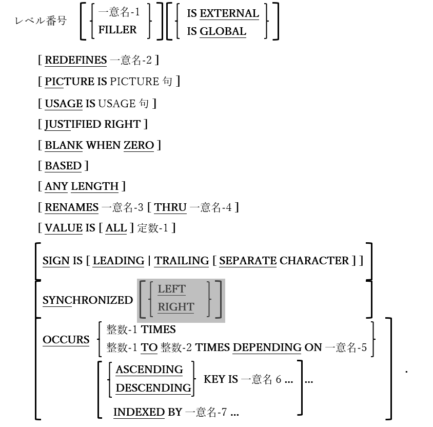

## 5.3. データ記述の形式

図5-5-データ記述の一般形式



ここで示した構文の骨組みは、画面節を除く、すべてのデータ部の節でデータ項目が定義される方法を提示している。

1. レベル番号の直後に一意名またはFILLERを指定しない場合、FILLERを指定した場合と同じ動きをする。

2. 他のCOBOL実装と同様に、レベル番号は以下の値に制限されている。


    | | | 
    | --- | --- | 
    |  01   |  最上位レベルのデータ項目で、それ自体で完成している場合(基本項目とも呼ばれる)もあれば、従属項目に分割される場合(集団項目とも呼ばれる)もある。01レベルのデータ項目は「レコード」または「レコード記述」とよく呼ばれる。   | 
    |  02-49   |  上位レベルのデータ項目の、従属部品であるデータ項目を定義するために使用されるレベル番号(レベル番号が数値的に小さいほど、定義されているデータ構造の階層全体で、データ項目は大きくなる―すべての構造化データは、単一の01レベルの項目から始める必要がある)。レベル02-49のすべてが基本項目でも良いし、レベル02-48がすべて集団項目でも良い。   | 
    |  66   |  項目の再集団化－RENAMES句は唯一このような項目を許可している。   | 
    |  77   |  従属項目に分割されず、他のデータの従属項目でもないデータ項目(レベル01を使用しても同じことができるため、あまり使われない)。   | 


    この他にも特別な使い方をする二つのレベル番号(78と88)があるが、それは5.5(78)と5.4(88)でそれぞれ解説する。

3. レベル66のデータ項目は、すべてを参照できる集団項目名(一意名-1)を定義するように再集団化された構造内の、連続するデータ項目の再集団化にすぎない。

4. PICTURE句は、定義されているデータ項目に含まれる可能性のあるデータのクラス(数値、アルファベット、または英数字)を定義する。また、データ項目用に予約されているストレージの容量も、(場合によってはUSAGE句と組み合わせて)定義する。基本的な3つのクラス定義 PICTURE記号には以下の用途がある。

    表5-6-データのクラス定義 PICTURE記号(9/A/X)

    | 基本記号 | 意味・使用方法  |
      | :--- | :--- |
      | 9 | 1桁の10進数用に予約されている場所を定義する。実際に占有されるストレージ量は、指定されるUSAGE句によって異なる。|
      | A | 単一の英字(「A」-「Z」、「a」-「z」)用に予約されている場所を定義する。各「A」は1バイトのストレージを表す。|
      |X | 1つの文字のストレージ用に予約されている場所を定義する。 各「X」は1バイトのストレージを表す。|
      | N |1つの日本語文字のストレージ用に予約されている場所を定義する。 各「N」は2バイトのストレージを表す。|

    以上の四つの記号は、PICTURE句で繰り返し使用され、項目内に含まれる可能性のあるデータのクラス数を定義する。例：

    |     |     | 
    | --- | --- | 
    | PIC 9999    | 4桁の正数を格納できるデータ項目を割り当てる(負の値については後述する)。項目のUSAGE句がDISPLAY指定(既定値)の場合、4バイトのストレージが割り当てられ、各バイトに「0」「1」「2」･･･「8」または「9」を入れることができる。数字限定というルールは実行時には強制されないが、コンパイル時にはルールに違反する定数値が項目にMOVEされた場合、エラー警告が表示される。ランタイムエラーはクラスの条件テストを使用することで検出できる([6.1.4.2.2](6-1-4-2.md)を参照)。    | 
    | PIC 9(4)    | 上記と同様－括弧で囲まれた繰り返し回数は、繰り返しを許可する任意のPICTURE記号で使用できる。    | 
    | PIC X(10)    |  このデータ項目は任意の10文字(英数字形式)の文字列を格納できる。   | 
    | PIC A(10)    |  このデータ項目は任意の10文字(書式編集形式)の文字列を格納できる。文字のみが許可されるという強制はないが、エラーはクラスの条件テストを介して検出できる([6.1.4.2.2](6-1-4-2.md)を参照)。   | 
    | PIC AA9(3)A    | X6を指定するのと全く同じことだが、値を2文字、3桁、1文字の順にする必要があることを文書化している。文字の位置をチェックする「総当たり攻撃」以外に、強制やエラー検出機能はない。    | 
    | PIC N(10)    | 10文字の日本語文字を格納できるデータ項目で、20バイトのストレージが割り当てられる。| 

 
    
    「A」 または「X」のPICTURE記号を含むデータ項目は算術演算には使用できない。

    上記に加え、表5-7は「PIC 9」データ項目で使用できる数値形式オプションのPICTURE記号を示している。

    表5-7-数値形式オプションのPICTURE記号(P/S/V)

    | 数値形式の オプション記号 | 意味・使用方法  |
      | :--- | :--- |
      | P | 実行時にデータ項目が参照されるとき0と見なされる、暗黙の桁位置を定義する。値の末尾に特定数の後続ゼロ(「P」につき1つ)が存在すると想定することによって、より少ないストレージを使用して、非常に大きい値を含んだデータ項目を割り当てられるように、この記号が使用される。<br>このようなデータ項目に対して実行されるすべての演算およびその他の操作は、ゼロが実際に存在しているかのように動作する。<br>値がそのような項目に格納されると、「P」記号で定義された桁位置は削除される。<br>例えば、会社の今年の総収益に何百ドルもの収益を含んだデータ項目を割り当てる必要があるとする：<br>01 Gross-Revenue PIC 9(9).<br>このとき9バイトのストレージが予約され、値の000000000～999999999は総収益を表す。ただし、百万以下の単位が固定される場合(つまり後ろの6桁が常に0になる)、項目を次のように定義できる。<br>01 Gross-revenue PIC 9(3)P(6).<br>プログラム内でGross-Revenueが参照されるときは必ず、ストレージ内の実際の値は、各P記号(この場合では全部で6つ)がゼロであるかのように扱われる。項目に1億2800万の値を格納するときは、「P」が「9」であるかのように扱う。<br>MOVE 128000000 TO Gross-Revenue.|
     | S |PICTURE値の最初の記号として使用する必要があり、このデータ項目では負の値が扱えることを示す。「S」がなければ、MOVE文または算術文を介してデータ項目に格納された負の値からは、負の符号が取り除かれる(実際には絶対値となる)。|
      | V |暗黙の小数点(存在する場合)が数値項目のどこにあるかを定義するために使用される記号。数値には小数点が1つしかないのと同じように、PICTURE句には「V」が1つしかない。暗黙の小数点はストレージ内の空白を占有せずに、値の使用方法を指定する。例えば、値「1234」がPIC 999V9として定義された項目のストレージ内にある場合、その値を参照するすべての文で「123.4」として扱われる。|

5. USAGE DISPLAYの数値データにのみ許可されるSIGN句は、「S」記号の表現形式を指定する。SEPARATE CHARACTER句の指定がないとき、データ項目の値の符号は、最終桁(TRAILING)または先頭桁(LEARDING)を次のように変換することで符号化できる。

    表5-8-符号エンコード文字

    | 最終/先頭桁 | 正の数への変換値  |負の数への変換値|
    | :---: | :---: |:---: |
    |0|0|p|
    |1|1|q|
    |2|2|r|
    |3|3|s|
    |4|4|t|
    |5|5|u|
    |6|6|v|
    |7|7|w|
    |8|8|x|
    |9|9|y|

    SEPARATE CHARACTER句が使用されている場合、実際の「+」または「-」記号が、先頭(LEADING)または最終(TRAILING)の文字として、項目の値に挿入される。


6. opensource COBOLは以下の表のように、「$」、カンマ、アスタリスク(*)、小数点、CR、DB、+(プラス)、-(マイナス)、「B」、「0」(ゼロ)および「/」といった、すべての標準COBOL PICTURE編集記号を利用できる。

    表5-9-数字編集PICTURE記号

   | 編集記号 | 意味・使用方法  |
    | :--- | :--- |
    |-(マイナス)|この記号は、PICTURE句 の最初または最後に使用する必要がある。「-」を使用する場合、「+」、「CR」そして「DB」のいずれも使用することはできない。数字の編集に使用する。<br>複数の「-」記号を連続して使用することは、項目の先頭でのみ許可される。これは*浮動マイナス記号*と呼ばれる。<br>各「-」記号は、データ項目のサイズの1文字位置としてカウントされる。<br>「-」記号が1つだけ指定されている場合、その記号は、項目に移動した値が負の場合は「-」に、そうでない場合は空白に「置き換え」られる。<br>浮動マイナス記号が使用されている場合、編集プロセスは次のように機能すると考えること：<br>1. 各「-」が実際には「9」である場合の編集値を決定する。<br>2. 右端の「-」に対応する編集結果の数字を見つけ、その位置から編集値を左にスキャンしていき、左側に「0」文字しかない「0」に到達するまで続ける。<br>3. 項目に移動した値が負の場合は「0」を「-」に、そうでない場合は空白に置き換える。<br>4. その位置の左側にある残りの「0」文字をすべて空白で置き換える。<br>例(記号~~b~~は空白を表す)：|
    |¥<sup>7</sup>|この記号は、「+」または「-」がPICTURE句の左側に表示される場合を除き、その最初だけに使用する必要がある。数字の編集に使用する。<br>複数の「¥」記号を連続して使用することができ、*浮動通貨記号*と呼ばれる。<br>各「¥」記号は、データ項目のサイズの1文字位置としてカウントされる。<br>「¥」記号が1つだけ指定されている場合、項目値の有効桁数が多すぎて「¥」が占める位置が先頭のゼロ以外の数字を表す必要がある場合を除いて、その記号は編集値の位置に挿入される。この場合、「¥」は「9」として扱われる。<br>浮動通貨記号が使用されている場合、編集プロセスは次のように機能すると考えること：<br>1. 各「¥」が実際には「9」である場合の編集値を決定する。<br>2. 右端の「¥」に対応する編集結果の数字を見つけ、その位置から編集値を左にスキャンしていき、左側に「0」文字しかない「0」に到達するまで続ける。<br>3. 「0」を「¥」に置き換える。<br>4. その位置の左側にある残りの「0」文字をすべて空白で置き換える。<br>例(記号~~b~~は空白を表す)：|
    |*(アスタリスク)|この記号は、「+」または「-」がPICTURE句の左側に表示される場合を除き、その最初だけに使用する必要がある。数字の編集に使用する。<br>複数の「 \* 」記号の連続した使用は、許可されているだけでなく、一般的な使用法である。これを*浮動チェック保護記号*と呼ぶ。<br>各「\*」記号は、データ項目のサイズの1文字位置としてカウントされる。<br>編集プロセスは、次のように機能すると考えること：<br>1. 各「 * 」が実際には「9」である場合の編集値を決定する。<br>2. 右端の「 * 」に対応する編集結果の数字を見つけ、その位置から編集値を左にスキャンしていき、左側に「0」文字しかない「0」に到達するまで続ける。<br>3. 「0」を「 * 」に置き換える。<br>4. その位置の左側にある残りの「0」文字をすべて「 * 」に置き換える。<br>例：<br>|
    |,(カンマ)<sup>8</sup>|PICTURE文字列内の各カンマ(,)は、文字「,」が挿入される文字位置を表す。この文字位置は項目のサイズにカウントされる。「,」記号は、「,」文字の挿入を必要とする数字編集の桁数の精度が不十分である場合に、その左右にある<u>浮動</u>記号に見せかけることができる「スマート記号」である。<br>例(記号~~b~~は空白を表す)：|
    |.(ピリオド)<sup>8</sup>|この記号は、暗黙の小数点が値に存在する位置で、編集値に小数点を挿入する。数字の編集に使用する。データ項目定義の最後に指定されたピリオドは、編集記号として扱われないことに注意すること！<br>例：<br>**01 Edited-Value PIC 9(3).99.<br>01 Payment PIC 9(3)V99 VALUE 152.19.<br>...<br>MOVE Payment TO Edited-Value.<br>DISPLAY Edited-Value.**<br>152.19が表示される。|
    |/(スラッシュ)|この記号は、通常、印刷物の日付編集に使用され、編集値に「/」文字を挿入する。<br>英数字編集項目の場合、挿入された「/」文字は、編集結果で1バイトのストレージを占有する。<br>日本語編集項目の場合、挿入された「／」文字は、編集結果で2バイトのストレージを占有する。<br>例：<br>**01 Edited-Date PIC 99/99/9999.<br>･･･<br>MOVE 08182009 TO Edited-Date.<br>DISPLAY Edited-Date.**<br>08/18/2009が表示される。|
    |+(プラス)|この記号は、PICTURE句の最初または最後に使用する必要がある。「+」を使用する場合、「-」、「CR」そして「DB」のいずれも使用することはできない。数字の編集に使用する。<br>複数の「+」記号を連続して使用することは、項目の先頭でのみ許可される。これは*浮動プラス記号*と呼ばれる。<br>各「+」記号は、データ項目のサイズの1文字位置としてカウントされる。<br>「+」記号が1つだけ指定されている場合、その記号は、項目に移動した値が負の場合は「-」に、そうでない場合は「+」に「置き換え」られる。<br>浮動マイナス記号が使用されている場合、編集プロセスは次のように機能すると考えること：<br>1. 各「+」が実際には「9」である場合の編集値を決定する。<br>2. 右端の「+」に対応する編集結果の数字を見つけ、その位置から編集値を左にスキャンしていき、左側に「0」文字しかない「0」に到達するまで続ける。<br>3. 項目に移動した値が負の場合は「0」を「-」に、そうでない場合は「+」に置き換える。<br>4. その位置の左側にある残りの「0」文字をすべて空白で置き換える。<br>例(記号~~b~~は空白を表す)：|
    |0(ゼロ)|この記号は、編集値に「0」文字を挿入する。挿入された「0」文字は、編集結果で1バイトのストレージを占有する。<br>例：<br>**01 Edited-Phone-Number PIC 9(3)B9(3)B9(4).<br>･･･<br>MOVE 5185551212 TO Edited-Phone-Number.<br>DISPLAY Edited-Phone-Number.**<br>518 555 1212と表示される。|
    |B|この記号は、空白文字を編集値に挿入する。<br>英数字編集項目の場合、挿入された空白文字は、編集結果で1バイトのストレージを占有する。<br>日本語編集項目の場合、挿入された日本語空白文字は、編集結果で2バイトのストレージを占有する。<br>例：<br>**01 Edited-Phone-Number PIC 9(3)B9(3)B9(4).<br>･･･<br>MOVE 5185551212 TO Edited-Phone-Number.<br>DISPLAY Edited-Phone-Number.**<br>518 555 1212と表示される。|
    |CR|この記号は、PICTURE句の最後に使用する必要がある。「CR」を使用する場合、「-」、「+」そして「DB」のいずれも使用することはできない。数字の編集に使用する。<br>1つのPICTURE句で複数の「CR」記号を使用することはできない。<br>「CR」記号は、データ項目のサイズで2文字の位置としてカウントされる。<br>項目に移動した値が負の場合、文字「CR」が編集値に挿入される。それ以外の場合は、2つの空白が挿入される。<br>例(記号~~b~~は空白を表す)：|
    |DB|この記号は、PICTURE句の最後に使用する必要がある。「DB」を使用する場合、「-」、「+」そして「CR」のいずれも使用することはできない。数字の編集に使用する。<br>1つのPICTURE句で複数の「DB」記号を使用することはできない。<br>「DB」記号は、データ項目のサイズで2文字の位置としてカウントされる。<br>項目に移動した値が負の場合、文字「DB」が編集値に挿入される。それ以外の場合は、2つの空白が挿入される。<br>例(記号~~b~~は空白を表す)：|
    |Z|この記号は、「+」または「-」がPICTURE句の左側に表示される場合を除き、その最初だけに使用する必要がある。数字の編集に使用する。<br>複数の「Z」記号の連続した使用は、許可されているだけでなく、一般的な使用法である。これを*浮動ゼロサプレッション*と呼ぶ。<br>各「Z」記号は、データ項目のサイズの1文字位置としてカウントされる。<br>編集プロセスは、次のように機能すると考えること：<br>1. 各「Z」が実際には「9」である場合の編集値を決定する。<br>2. 右端の「Z」に対応する編集結果の数字を見つけ、その位置から編集値を左にスキャンしていき、左側に「0」文字しかない「0」に到達するまで続ける。<br>3. 「0」を空白に置き換える。<br>4. その位置の左側にある残りの「0」文字をすべて空白に置き換える。<br>例(記号~~b~~は空白を表す)：|
 
     同じPICTURE句で、複数の編集記号を浮動方式で使用することはできない。

7. 編集記号を含む数値データ項目は、数値編集項目と呼ばれる。このようなデータ項目は、様々な算術文で値を受け取る場合があるが、同じ文でデータのソースとして使用することはできない。これに該当するのは、ADD文(6.5)、COMPUTE文(6.11)、DIVIDE文(6.15)、MULTIPLY文(6.29)、およびSUBTRACT文(6.44)である。

8. EXTERNAL句を指定することにより、データ項目が各コンパイル単位で(EXTERNAL句を使って)記述されている場合、定義されているデータ項目は、特定の実行スレッド内のすべてのプログラム単位(個別にコンパイルされるか、同じコンパイル単位でコンパイルされる)間で共有できる。

9. GLOBAL句を指定することにより、データ項目は、各プログラム単位でGLOBAL句を使って記述されている場合、<u>そして</u>GLOBAL句を使用したすべてのプログラム単位が、GLOBAL句を使用したデータ項目を定義する最初のプログラム単位内に<u>ネスト</u>されている場合、特定の実行スレッド内の同じコンパイル単位内のすべてのプログラム単位間で共有できる。プログラム単位のネストについては、2.1で説明している。

10. EXTERNAL句は、77または01レベルでのみ指定できる。

11. EXTERNAL項目にはデータ名(つまり一意名-1)が必要であり、その名前をFILLERにすることは<u>できない。</u>

12. EXTERNAL句は、GLOBAL句、REDEFINES句、またはBASED句と組み合わせることはできない。

13. VALUE句は、EXTERNALデータ項目、またはEXTERNALデータ項目に従属するものとして定義されたデータ項目では無視される。

14. OCCURS句は、複数回繰り返される表`9`と呼ばれるデータ構造を作成するため、次の例のように使用される。

        05 QUARTLY-REVENUE OCCURS 4 TIMES PIC 9(7)V99.

    以下のように割り当てられる。

    

    各オカレンスは、上で示されている添字構文(括弧で囲まれた数字定数、算術式、または数値識別子)を使用して参照される。OCCURS句は集団レベルでも使用でき、集団構造全体が次のように繰り返される。
    ```
          05 X OCCURS 3 TIMES.
            10 A       PIC X(1).
            10 B       PIC X(1).
            10 C       PIC X(1).
    ```
      

    表の詳細については、6.1.1(表の参照)、6.38(SEARCH)、6.40(SORT)、および以下の28項で説明する。

15. オプションのDEPENDING ON句をOCCURS句に追加することで、可変長テーブルを作成できる。このような表は、整数-2で指定された最大サイズまで割り当てられる。
    実行時、一意名-5の値によって、アクセス可能な表の要素数が決まる。

16. レベル番号が01、66、77、88のデータ記述項にはOCCURS句を指定できない。

17. VALUE句は、コンパイラによって生成されたプログラムオブジェクトコード内のデータ項目が占有するストレージに割り当てられる、コンパイル時の初期値を指定する。オプションの「ALL」句は英数字定数でのみ使用でき、データ項目が完全に埋まるまで必要に応じて値が繰り返される。以下はALLを使用する場合と、使用しない場合の例である。

    ```
      PIC X(5) VALUE “A” – 次の値を保持する “A”,空白,空白,空白,空白
      PIC X(5) VALUE ALL “A” – 次の値を保持する “A”,”A”,”A”,”A”,”A”
      PIC 9(3) VALUE 1 – 次の値を保持する 001
      PIC 9(3) VALUE ALL “1” – 次の値を保持する 111
    ```

18. ASCENDING KEY句、DESCENDING KEY句、およびINDEXED BY句については、6.39(SEARCH)で説明する。

19. BASED句とANY LENGTH句を併用することはできない。

20. JUSTIFIED RIGHT句は、アルファベット(PIC A)または英数字(PIC X)項目でのみ有効であり、データ項目の長さよりも短い値は、データ項目にMOVEされるときに右端に詰められ、空白で埋められる。

21. BASED句で宣言されたデータ項目には、コンパイル時にストレージが割り当てられない。実行時にALLOCATE文を使用することによって領域を割り当て、(オプションで)項目を初期化する。

22. ANY LENGTH属性で宣言されたデータ項目には、コンパイル時の固定長はない。この項目は、サブルーチン引数の説明としての機能であるため、連絡節でのみ定義することができる。ANY LENGTH項目には、A、X、または9記号を1つだけ指定するPICTURE句が必要である。

23. BLANK WHEN ZERO句を数値項目で使用すると、その項目に0の値がMOVEされた場合、値が自動的に空白に変換される。

24. REDEFINES句により、一意名-1は一意名-2と同じ物理ストレージ領域を占有するため、ストレージは(おそらく)異なる構造、そして異なる方法で定義される。REDEFINES句を使用するには、次の条件がすべて満たされている必要がある

    a.一意名-2のレベル番号は一意名-1のレベル番号と同じでなければならない。

    b. 一意名-2(および一意名-1)のレベル番号は、66、77、78、または88にすることはできない。

    c. 「n」が一意名-2(および一意名-1)のレベル番号を表す場合、レベル番号「n」の他のデータ項目を、一意名-1と一意名-2の間に定義することはできない。

    d. 一意名-1に割り当てられた合計サイズは、一意名-2に割り当てられた合計サイズと同じでなければならない。

    e. 一意名-2にOCCURS句を定義することはできない。ただし、一意名-2<u>に従属する</u>OCCURS句で定義された項目が存在する場合がある。

    f. 一意名-2にVALUE句を定義することはできない。88レベルの条件名を除き、一意名-2に従属するデータ項目にVALUE句を含めることはできない。

25. 次の表は、利用可能なUSAGE句をまとめたものである。

    表5-10-USAGE句一覧<br>
    
    | USAGE句 | 割り当て領域(バイト)  |ストレージ形式|負の値|PIC|類似USAGE句|
      | :--- | :--- |:--- | :--- |:--- | :--- |
      |<u>BINARY</u>|PICTURE句の「9」の数と、プログラムのコンパイルに使用される構成ファイル(7.1.8)の「バイナリサイズ」設定によって異なる。|最互換性―24項参照|PICTURE 句に「S」記号がある場合は可|可|COMPUTATIONAL, COMPUTATIONAL-4|
      |<u>BINARY-CHAR</u> or <u>BINARY-CHAR SIGNED</u>|1バイト|ネイティブ―24項参照|可|不可||
      |<u>BINARY-CHAR UNSIGNED</u>|1バイト|ネイティブ―24項参照|不可―25項参照|不可||
      |<u>BINARY-C-LONG</u> or <u>BINARY-C-LONG SIGNED</u>|コンピュータのC言語の「long」データ型と同じ量のストレージを割り当てる。通常は32ビットだが、64ビットの場合もある。|ネイティブ―24項参照|可|不可||
      |<u>BINARY-C-LONG UNSIGNED</u>|コンピュータのC言語の「long」データ型と同じ量のストレージを割り当てる。通常は32ビットだが、64ビットの場合もある。|ネイティブ―24項参照|不可―25項参照|不可||
      |<u>BINARY-DOUBLE</u> or <u>BINARY-DOUBLE SIGNED</u>|「従来の」ダブルワード(64ビット)のストレージを割り当てる。|ネイティブ―24項参照|可|不可||
      |<u>BINARY-DOUBLE UNSIGNED</u>|「従来の」ダブルワード(64ビット)のストレージを割り当てる。|ネイティブ―24項参照|不可―25項参照|不可||
      |<u>BINARY-LONG</u> or <u>BINARY-LONG SIGNED</u>|ワード(32ビット) のストレージを割り当てる。|ネイティブ―24項参照|可|不可|SIGNED-LONG, SIGNED-INT|
      |<u>BINARY-LONG UNSIGNED</u>|ワード(32ビット) のストレージを割り当てる。|ネイティブ―24項参照|不可―25項参照|不可|UNSIGNED-LONG, UNSIGNED-INT|
      |<u>BINARY-SHORT</u> or <u>BINARY-SHORT SIGNED</u>|ハーフワード(16ビット) のストレージを割り当てる。|ネイティブ―24項参照|可|不可|SIGNED-SHORT|
      |<u>BINARY-SHORT UNSIGNED</u>|ハーフワード(16ビット) のストレージを割り当てる。|ネイティブ―24項参照|不可―25項参照|不可|UNSIGNED-SHORT|
      |<u>COMP</u>UTATIONAL|PICTURE句の「9」の数と、プログラムのコンパイルに使用される構成ファイル(7.1.8)の「バイナリサイズ」設定によって異なる。|最互換性―24項参照|PICTURE 句に「S」記号がある場合は可|可|BINARY, COMPUTATIONAL-4|
      |<u>COMP</u>UTATIONAL<u>-1</u>|ワード(32ビット) のストレージを割り当てる。|単精度浮動小数点|可|不可||
      |<u>COMP</u>UTATIONAL<u>-2</u>|「従来の」ダブルワード(64ビット) のストレージを割り当てる。|倍精度浮動小数点|可|不可||
      |<u>COMP</u>UTATIONAL<u>-3</u>|PICTURE句の「9」ごとに4ビットを割り当て、さらに符号用に(末尾の)4バイト項目を割り当て、最も近いバイトに切り上げる。SYNCHRONIZED RIGHT(27項参照)|パック10進数―26項参照|PICTURE 句に「S」記号がある場合は可|不可|PACKED-DECIMAL|
      |<u>COMP</u>UTATIONAL<u>-4</u>|PICTURE句の「9」の数と、プログラムのコンパイルに使用される構成ファイル(7.1.8)の「バイナリサイズ」設定によって異なる。|最互換性―24項参照|PICTURE 句に「S」記号がある場合は可|可|BINARY, COMPUTATIONAL|
      |<u>COMP</u>UTATIONAL<u>-5</u>|PICTURE句の「9」の数と、プログラムのコンパイルに使用される構成ファイル(7.1.8)の「バイナリサイズ」設定によって異なる。||PICTURE 句に「S」記号がある場合は可|可||
      |<u>COMP</u>UTATIONAL<u>-X</u>|プログラムのコンパイルに使用される構成ファイル内の「1～8」の「バイナリサイズ」設定に従って、PICTURE句の「9」の数に基づいてバイトを割り当てる。「バイナリサイズ」の値「1～8」がどのように機能するかについては、[7.1.8](7-1.md)を参照すること。|最互換性―24項参照|PICTURE 句に「S」記号がある場合は可|可||
      |<u>DISP</u>LAY|PICTURE句に基づく―PICTURE句のX、A、9、ピリオド、¥、Z、0、*、S(SEPARATE CHARACTERが指定されている場合)、+、-、またはB記号ごとに1文字10を割り当てる。DBまたはCR記号が使用されている場合は、さらに2バイトを追加する。|文字|PICTURE 句に「S」記号がある場合は可|可||
      |<u>INDEX</u>|ワード(32ビット) のストレージを割り当てる。|ネイティブ―24項参照|不可|不可||
      |NATIONAL|USAGE NATIONAL は、構文的には認識されるが、opensource COBOL ではサポートされていない。|
      |<u>PACKED-DECIMAL</u>|PICTURE句の「9」ごとに4ビットを割り当て、さらに符号用に(末尾の)4バイト項目を割り当て、最も近いバイトに切り上げる。SYNCHRONIZED RIGHT(27項参照)|パック10進数―26項参照|PICTURE 句に「S」記号がある場合は可|不可|COMPUTATIONAL-3|
      |<u>POINTER</u>|ワード(32ビット) のストレージを割り当てる。|ネイティブ―24項参照|不可|不可||
      |<u>PROGRAM-POINTER</u>|ワード(32ビット) のストレージを割り当てる。|ネイティブ―24項参照|不可|不可||
      |<u>SIGNED-INT</u>|ワード(32ビット) のストレージを割り当てる。|ネイティブ―24項参照|可|不可|BINARY-LONG-SIGNED,SIGNED-LONG|
      |<u>SIGNED-LONG</u>|ワード(32ビット) のストレージを割り当てる。|ネイティブ―24項参照|可|不可|BINARY-LONG SIGNED, SIGNED-INT|
      |<u>SIGNED-SHORT</u>|ハーフワード(16ビット) のストレージを割り当てる。|ネイティブ―24項参照|可|不可|BINARY SHORT SIGNED|
      |<u>UNSIGNED-INT</u>|ワード(32ビット) のストレージを割り当てる。|ネイティブ―24項参照|不可―25項参照|不可|BINARY-LONG UNSIGNED,UNSIGNED-LONG|
      |<u>UNSIGNED-LONG</u>|ワード(32ビット) のストレージを割り当てる。|ネイティブ―24項参照|不可―25項参照|不可|BINARY-LONG UNSIGNED,UNSIGNED-INT|
      |<u>UNSIGNED-SHORT</u>|ハーフワード(16ビット) のストレージを割り当てる。|ネイティブ―24項参照|不可―25項参照|不可|BINARY-SHORT UNSIGNED|

26. バイナリデータは、「ビッグエンディアン」または「リトルエンディアン」形式で格納することができる。

    ビッグエンディアンのデータ割り当てでは、バイナリ項目を構成するバイトについて、最下位バイトが<u>右</u>端のバイトとなるように割り当てられる。例えば、10進数で20の値を持つ4バイトのバイナリ項目は、00000014(16進表記で表示)として割り当てられるビッグエンディアンとなる。

    リトルエンディアンのデータ割り当てでは、バイナリ項目を構成するバイトについて、最下位バイトが<u>左</u>端のバイトとなるように割り当てられる。例えば、10進数で20の値を持つ4バイトのバイナリ項目は、14000000(16進表記で表示)として割り当てられるリトルエンディアンとなる。

    CPUはビッグエンディアン形式を「理解」できるため、コンピュータシステム間でバイナリストレージの「最互換性」形式となる。

    一部のCPU―ほとんどのWindows PCで使用されているIntel/AMD i386/x64アーキテクチャプロセッサなど―は、リトルエンディアン形式で格納されたバイナリデータの処理を得意とする。この形式が上記システムでより効率的であるため、「ネイティブ」バイナリ形式と呼ばれる。

    バイナリストレージの1つの形式(通常はビッグエンディアン)のみをサポートするシステムでは、「最効率的な形式」と「ネイティブ形式」は同義語である。

27. UNSIGNED属性が明示的にコーディングされているバイナリデータ項目、またはPICTURE句に「S」記号がないバイナリデータ項目に、負の値を格納することはできない。このような項目に負の値を格納しようとすると、実際には正の数であるかのように解釈される負の数のバイナリ表現が発生する。例えば、IntelまたはAMDプロセッサを実行しているコンピュータでは、バイナリ値として表される-3の値は11111101<sub>2</sub>になる。その値がUSAGE BINARY-CHAR UNSIGNED項目に格納されると、実際には011111101<sub>2</sub>または253として解釈される。

28. パック10進数(つまり、USAGE COMP-3またはUSAGE PACKED-DECIMAL)データは、各バイトに2つの4ビット項目が含まれ、各項目がPICTURE句の「9」を表し、10進数1桁を格納する一連のバイトとして格納される。最後のバイトには、常に単一の4ビット数字(「9」に対応する)と4ビットの符号指示子(「S」記号が使用されていなくても常に存在する)が含まれる。最初のバイトには、PICTURE句で使用された「9」記号の数に応じて、未使用の左端の4ビット項目が含まれる。符号指示子は、AからFまでの16進数の値で、A、C、E、およびFは正、BまたはDは負を示す。したがって、値が-15のPIC S9(3) COMP-3パック10進数項目は、16進数の015D(または015B)が格納される。PICTURE句に「S」が含まれていないパック10進数項目に負の数を格納しようとすると、実際には負の数の絶対値が格納される。

29. SYNCHRONIZED句(SYNCと省略される場合がある)は、バイナリ数値項目のストレージを最適化し、CPUのフェッチを可能な限り高速化して格納する。この同期は次のように実行される。

    a. バイナリ項目が1バイトのストレージを占有する場合、同期は実行されない。

    b. バイナリ項目が2バイトのストレージを占有する場合、バイナリ項目は次のハーフワード境界に割り当てられる。

    c. バイナリ項目が4バイトのストレージを占有する場合、バイナリ項目は次のワード境界に割り当てられる。

    d. バイナリ項目が4バイトのストレージを占有する場合、バイナリ項目は次のワード境界に割り当てられる。

    次に示すのは、SYNCHRONIZED句を使用する場合、そして使用しない場合の集団項目のストレージ割り当ての例である。

    図5-11 - SYNCHRONIZED句の効果

    

    灰色のブロックは、SYNC句によって**集団項目-2**構造に割り当てられた、未使用の「遊び」バイトを表す。

    SYNCHRONIZED句のLEFTおよびRIGHTオプションは、他のCOBOL実装との構文上の互換性のために認識はされるが、機能しない。

30. 表の初期化は、COBOLデータ定義の難しい側面の1つである。基本的に3つの標準的な手法と、他のCOBOL実装に精通しているがopensource COBOLに慣れていない人にとっては興味深いと思われる4つ目の手法がある。以下の3つは「標準的な」手法である。

    a. コンパイル時に気にする必要はない。INITIALIZE文を使用して、表の内のすべてのデータ項目オカレンスを(実行時に)、データ型固有の初期値(数値：0、英字および英数字：空白)に初期化する。

    b. 次のように、表の「親」として機能する集団項目にVALUE句を含めることで、コンパイル時に小さな表を初期化する。
    ```
        05 SHIRT-SIZES          VALUE “S 14M 15L    16XL17”.
           10 SHIRT-SIZE-TBL    OCCURS 4 TIMES.
              15 SST-SIZE       PIC X(2).
              15 SST-NECK       PIC 9(2).
    ```
     c. REDEFINES句を使用して、コンパイル時にほぼすべてのサイズの表を初期化する。

      ```
      05 SHIRT-SIZE-VALUES.
         10 PIC X(4)          VALUE “S 14”.
         10 PIC X(4)          VALUE “M 15”.
         10 PIC X(4)          VALUE “L 16”.
         10 PIC X(4)          VALUE “XL17”.
      05 SHIRT-SIZES          REDEFINES        SHIRT-SIZE-VALUES.
         10 SHIRT-SIZE-TBL    OCCURS 4 TIMES.
            15 SST-SIZE       PIC X(2).
            15 SST-NECK       PIC 9(2).
       ```


    cに示した表は、明らかにbよりも冗長である。しかし、cが優れている点は、より大きな表に必要な数のFILLER/VALUE項目を記述できることである(そして、値  は必要なだけ長くすることができる！)

    多くのCOBOLコンパイラでは、同じデータ項目でVALUE句とOCCURS句を使用することはできず、OCCURS句に __従属する__ データ項目にVALUE句を使用するこ  ともできない。一方で、opensource COBOLにはこれらの制限はない。次の例は、opensource COBOLで表を初期化する4番目の方法である。

     ```
           05 X                OCCURS 6 TIMES.
             10 A              PIC X(1) VALUE “?‟.
             10 B              PIC X(1) VALUE “%‟.
             10 N              PIC 9(2) VALUE 10.
     ```

      この例では、6つの「A」項目が「?」、6つの「B」項目が「%」、そして6つの「N」項目が10に初期化される。この方法が役立つか分からないが、必要であれば使用できる。

---
`7` デフォルトの通貨記号は「$」であるが、他の国では異なる通貨記号を使用している。特殊名段落([4.1.4](4-1-4.md)を参照)では、任意の記号を通貨記号として定義することができる。例えば、通貨記号が「#」という文字に定義されている場合、「#」文字をPICTURE編集記号として使用できる。

`8` 特殊名段落で DECIMAL-POINT IS COMMA が指定されている場合、「.」と「,」の意味と使い方が反転する。

`9` あなたもよく知っている他のプログラミング言語では、このような構造を配列と呼ぶ。

`10` この属性では、1文字は1バイトと同じである。ただし、Unicodeを使用するopensource COBOLシステムを独自に構築した場合(可能性は低い)は1文字＝2バイトである。
