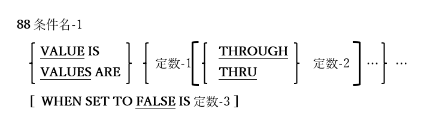

<!--navi start1-->
[前へ](5-3.md)/[目次](https://opensourcecobol.github.io/markdown/TOC.html)/[次へ](5-5.md)
<!--navi end1-->
## 5.4. 条件名

図5-12-レベル88条件名記述構文

条件名はブーリアン型(つまり「TRUE」/「FALSE」)のデータ項目である。

1. 条件名は常に別のデータ項目に従属して定義される。データ項目は基本項目である必要はない。

2. また、ストレージを占有しない。

3. 条件名に指定されたVALUE(s)は、条件名の値をTRUEにする親要素データ項目の特定の値、および/または、値の範囲を指定する。

4. オプションのFALSE句は、SET文を使用して条件名-1をFALSEに設定した場合に、親の基本データ項目に割り当てられる明示的な値を定義する。SET文を使用して、条件名のTRUE/FALSE値を指定する方法については、[6.39.6](6-39-6.md)で詳しく説明する。

5. 条件名については、[6.1.4.2.1](6-1-4-2.md#61421-条件名レベル88項目)でも説明する。

<!--navi start2-->

[ページトップへ](5-4.md)
<!--navi end2-->
