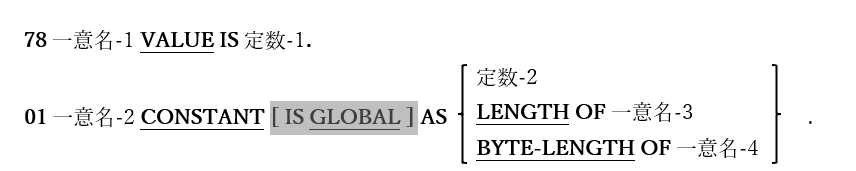

<!--navi start-->
[前へ](5-4.md)/[次へ](5-6.md)
<!--navi end-->
## 5.5. 定数記述

図5-13-78レベル定数記述構文

この形式のデータ項目は、実際にストレージを割り当てることはないが、その代わりに、名前を英数字または数字定数に関連付ける役割がある。

1. 定数値を定義する場合において、二つの形式は基本的に同じであるが、「01 CONSTANT」を使用した場合にのみ、値が別の項目の長さである定数を定義することが可能である。

2. GLOBAL句は構文的には認識されるが、現時点ではopensource COBOLでサポートされていないため、コンパイラ警告が表示される。しかし、2009年2月6日のopensource COBOL1.1パッケージ化の時点では、実際にコンパイラを中断させる可能性がある。
