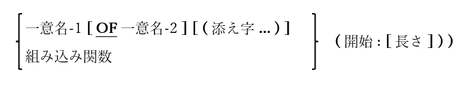

### 6.1.3. 部分参照

図6-1-部分参照構文

COBOL’85標準では、データ項目の一部のみへの参照を容易にするための部分参照の概念が導入された。opensource COBOLは、参照の修飾を完全にサポートしている。

開始値は、参照される開始文字位置を示し(文字位置の値は、一部のプログラミング言語は0から始まるが、この場合は1から始める)、長さは必要な文字数を指定する。長さが指定されていない場合、最初から最後までの残りの文字位置に相当する値が想定される。

ここでいくつか例を挙げる。

|     |     | 
| --- | --- | 
| CUSTOMER-LAST-NAME (1:3)    | CUSTOMER-LAST-NAMEの最初の3文字を参照する。    | 
| CUSTOMER-LAST-NAME (4:)    | CUSTOMER-LAST-NAMEの4番目以降のすべての文字位置を参照する。    | 
| FUNCTION CURRENT-DATE (5:2)    | 現在の月を参照する(詳細については6-13ページの「CURRENT-DATE組み込み関数」で説明する)。    | 
| Hex-Digits (Nibble + 1:1)    | 「Nibble」が0～15の範囲の値を持つ数値データ項目で、かつHex-Digitsが「0123456789ABCDEF」の値を持つPIC X(16)項目であるとすると、与えられた数値を16進数に変換する。    | 
| Array-Element (6) (7:5)    |  Array-Elementの6番目の配列の5文字を参照する。このとき文字位置は7から開始する。   | 

参照の修飾は、MOVE文、STRING文、ACCEPT文などの受け取り項目としても機能するなど、一意名が有効な場所であればどこでも使用できる。
