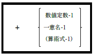
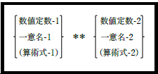
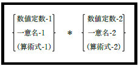
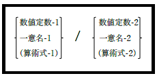
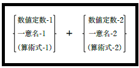
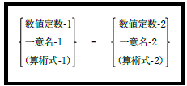

### 6.1.4. 式

opensource COBOLは他のCOBOL実装と同様に、基本となる2つの式をサポートする。

- 数値結果を計算する「算術式」

- TRUEまたはFALSE値を計算する「条件式」

0や-1などの算術値が、それぞれFALSEやTRUEを表す他のプログラミング言語とは違い、COBOLは論理的なTRUE/FALSE値と0/-1を異なるものとして扱う。opensource COBOLはこのポリシーに準拠している。

#### 6.1.4.1. 算術式

算術式は、次の演算子を使用して形成される。複数の演算子で構成される複雑な式では、演算の優先順位が適用され、優先順位の低い演算より高い演算の方が先行して計算される。

| 優先順位 演算子 | 意味 |
  | :---: | :--- |
  |図6-2-符号(-) 1番目(最上位)|単項減算演算子(-)は引数の算術否定を返す。引数と数字定数の-1を掛けた値を有効値とする。|
  |図6-3-符号(+) 1番目(最上位)|単項加算演算子(+)は引数の値を返す。引数と数字定数の+1を掛けた値を有効値とする。|
 |図6-4-べき乗演算子 2番目|演算子の左側の引数の値を、右側の引数で示されるべき乗で計算する。opensource COBOLでは「**」記号の代わりに「^」記号が使用できる。|
 |図6-5-乗算演算子 3番目|演算子の左右の引数の乗算を求める。|
 |図6-6-除算演算子 3番目|演算子の左右の引数の除算を求める。|
 |図6-7-加算演算子 4番目(最下位)|演算子の左右の引数の加算を求める。|
 |図6-8-減算演算子 4番目(最下位)|左側の引数から右側の引数を引いた値を求める。|

COBOL標準では、べき乗、乗算、除算、加算および減算演算子の前後に、少なくとも1つの空白を空ける必要がある。これによって、他のCOBOL実装との互換性を確保し、演算子前後の空白の省略を定義する以下の特別なルールを設ける必要がなくなるため、式をコーディングするときに従うべき最適なポリシーである。

1. opensource COBOLでは、べき乗、乗算、または除算の演算子の前後の空白は不要である。

2. 加算演算子の後に符号なしの数字定数が続く場合は、空白を空ける。空白を空けないと(例：「4+3」)、コンパイラは「+」を符号付き数字定数の指定として扱い、その場合、式に演算子が存在しないため「無効な式」エラーが発生する。その他では、加算演算子の前後の空白は任意となる。

3. 減算演算子の後に符号なしの数字定数が続く場合、空白を空ける。空白を空けないと(例：「4-3」)、コンパイラは「-」を符号付き数字定数の指定として扱い、その場合、式に演算子が存在しないため「無効な式」エラーが発生する。

4. どちらの引数も括弧で囲まれた式でない場合、減算演算子の前後に空白を空ける。いずれかの空白(「3-Arg」や「Arga-Argb」など)を空けなければ、コンパイラは(おそらく)存在しない定義済みの予約語やユーザ定義の名前を検索し、「「一意名」未定義」エラーを表示する。運が悪ければ、ランタイムエラーを確実に引き起こす一意名としてコンパイルされてしまうだろう。

5. 単項加算演算子の引数が、符号なしの数字定数であるとき、数字定数の一部として扱われないようにするために、単項加算演算子の後に空白を空ける必要がある(したがって、符号付き正数字定数となる)。

6. 単項否定演算子の引数が、符号なしの数字定数であるとき、数字定数の一部として扱われないようにするために、単項否定演算子の後に空白を空ける必要がある(したがって、符号付き負数字定数となる)。

ここでいくつか算術式の例を示す(説明を簡単にするため、すべての例に数字定数を使っている)。

| 式 | 計算結果  |解説|
  | :--- | :--- |:--- |
  |3 * 4 + 1|13|* は + よりも優先される。|
  |2 ^ 3 * 4 – 10|22|2の3乗は8、4を掛けて32、10を引いて22となる。|
  |2 ** 3 * 4 – 10|22|上記と同じ―opensource COBOLでは「^」または「**」のいずれかを、べき乗演算子として使用できる。|
  |3 * (4 + 1)|15|括弧は算術式ルールを再帰的に適用し、括弧で囲まれた算術式は、他の(より複雑な)算術式の構成要素となる。|
  |5 / 2.5 + 7 * 2 – 1.15|15.35|整数オペランドと非整数オペランドは、自由に混在させることができる。|

もちろん算術式のオペランドは、数値データ項目(DISPLAY、POINTER、またはPROGRAM POINTERを除く任意のUSAGE)および、数字定数をとることができる。
