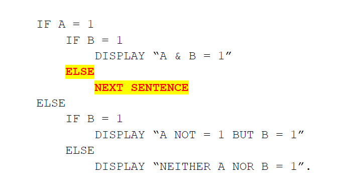
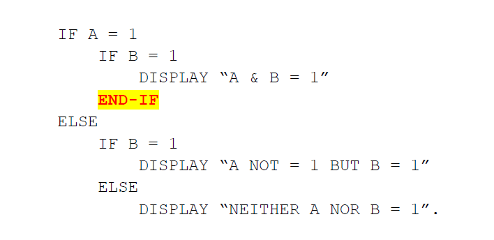
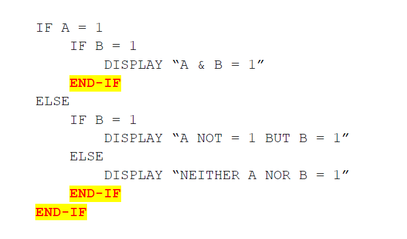

### 6.1.6. 動詞 / END-動詞

1985年のCOBOL標準以前は、文の範囲が終了することを通知する唯一の方法としてピリオドが使われていた。しかし、これにはある問題があった。

```
        IF A = 1
            IF B = 1
                DISPLAY “A & B = 1”
        ELSE
           IF B = 1
                DISPLAY “A NOT = 1 BUT B = 1”
           ELSE
                DISPLAY “NEITHER A NOR B = 1”.
```

このコードの問題は、ELSEが「IF A = 1」文ではなく、「IF B = 1」文の方に働いてしまうということだ(COBOLコンパイラはコードのインデントを判別しないことを覚えておこう)。こういった問題によって、COBOL言語に次のような応急処置としての解決策`12`が追加された。



NEXT SENTENCE文([6.30](6-30.md)参照)は、「B = 1」条件が偽の場合、次に来るピリオドの後に続く最初の文に進むようCOBOLに通知する。

1985年のCOBOL標準と比べて、かなり優れた解決策が導入された。応急処置が必要だったCOBOL文(ステートメント)は「END-動詞」構文を用いることによって、他の文の範囲に介入することなく自らの範囲を終了させることができた。COBOL85コンパイラであれば、以上の問題に対して次の解決策が有効だった：



しかし、この新たな文法によってピリオドを用いることは時代遅れとなり、今日のセグメント分割されたプログラムは、以下のようにコーディングされている。



COBOL(opensource COBOLも含む)では、手続き部の各段落に実行可能なコードがある場合、その段落には少なくとも一つの完結文が含まれている<u>必要がある</U>が、一般的なコーディング標準では、各段落の終わりにピリオドを一つコーディングするだけである。

COBOL標準では、範囲符としてピリオドを使用することは変わらず有効であるため、「END-動詞」の使用は任意としている。一部の文では、不要な「END-verb」範囲符が定義されている。`13`

既存のコードをopensource COBOLに書き込む場合は、コードが使う可能性がある言語およびコーディング標準に対応できるといった便利な機能がある。ただし、<u>新たに</u>opensource COBOLプログラムを作成する場合は、「END-動詞」構文を忠実に用いることを<u>強く</u>勧める。

---
`12` 例題のコードを「IF A = 1 AND B = 1」に変更すれば済む話ではあるのだが、ここでは私の主張を述べたいがために、あえて例のような表記にしている。

`13` 例えばSTRING(6.43)とUNSTRING(6.49)には、範囲符が必要なステートメントにオプションを導入するといった将来的な標準に向けての計画はあるのだろうか？
