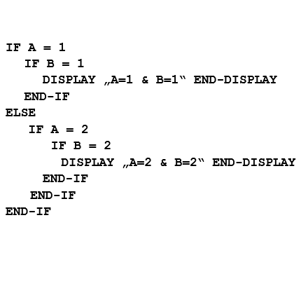
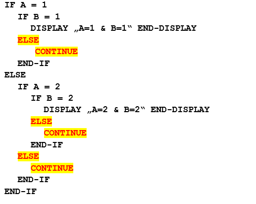

<!--navi start1-->
[前へ](6-11.md)/[目次](https://opensourcecobol.github.io/markdown/TOC.html)/[次へ](6-13-1.md)
<!--navi end1-->
## 6.12. CONTINUE

図6-39-CONTINUE構文

CONTINUE文は動作がないためアクションを実行しない。

1. CONTINUE文は、IF文([6.23](6-23.md))とともに、まだ必要とされていないか、または未設計の条件付きで実行されるコードのプレースホルダーとして多用される。次の二つの文は同等である。CONTINUE文を使うことで、今後コード挿入の必要があるかもしれない場所をマークする。

    

    上記のようなコーディングは、一般的に個人の嗜好やウェブサイトのコーディング基準の問題である。オブジェクトコード自体に違いはないため、実行時の動作効率には関係しない(「コーディングが効率的であるか」の一点だけ)。

2. CONTINUEのもう一つのIF文の使用法は、IF文でコーディングされた条件式でのNOTの使用を回避することで、これも個人的および/またはウェブサイト標準における問題である。例を以下に示す。

    

COBOL(opensource COBOLを含む)では条件式が省略形で処理されるため、左側の例の条件式は短縮版となっている。

            IF Action-Flag NOT = ‘I’ AND Action-Flag NOT = ‘U’

プログラマの多くは、「IF」を(誤って)「`IF Action-Flag NOT = ‘I’ OR ‘U’`」としてコーディングしていた。これにより、実行時に問題が発生することは避けられない。

従ってプログラマは、少し長くても右側の例のコードの方が読みやすいと考えている。

<!--navi start2-->

[ページトップへ](6-12.md)
<!--navi end2-->
