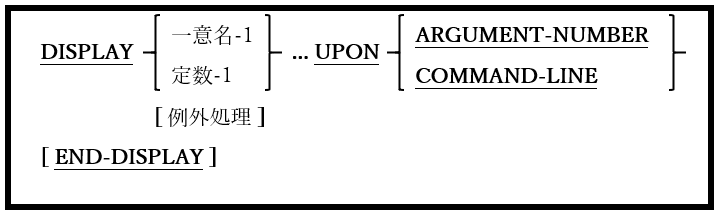

### 6.14.2. DISPLAY文の書き方2 ― コマンドライン引数へのアクセス

図6-43-DISPLAY構文(コマンドライン引数へのアクセス)

後続のACCEPTによって取得されるコマンドライン引数番号を指定したり、コマンドライン引数自体に新しい値を指定することができる。

1. DISPLAY･･･UPON COMMAND-LINEを実行すると、後続のACCEPT･･･FROM COMMAND-LINE文に影響する(その後にDISPLAYされた値が返される)が、後続のACCEPT･･･FROM ARGUMENT-VALUE文には影響せず、元のプログラム実行パラメータを返す 。
