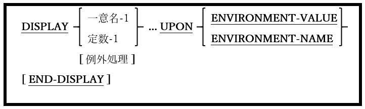

### 6.14.3. DISPLAY文の書き方3 ― 環境変数へのアクセスまたは設定

図6-44-DISPLAY構文(環境変数へのアクセス/設定)

環境変数を作成または変更するために使われる。

1. 環境変数を作成または変更するには、二つのDISPLAY文が必須となり、次の手順で実行する必要がある。

        DISPLAY
            environment-variable-name UPON ENVIRONMENT-NAME
        END-DISPLAY
        DISPLAY
            environment-variable-name UPON ENVIRONMENT-VALUE
        END-DISPLAY	
	

2. opensource COBOLプログラム内から作成または変更された環境変数は、そのプログラムによって生成されたサブシェルプロセス(つまり、CALL“ SYSTEM”)では使用できるが、opensource COBOLプログラムを開始したシェルまたはコンソールウィンドウからは認識されない。

3. DISPLAYの代わりにSET ENVIRONMENT(6.39.1)を使用して環境変数を設定する方がはるかに簡単である。
 