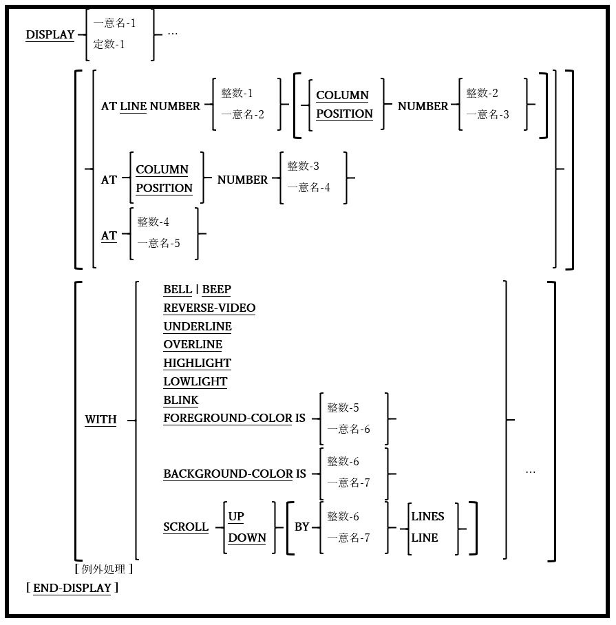

### 6.14.4. DISPLAY文の書き方4 ― 画面データ

図6-45-DISPLAY構文(画面データ)

形式化された画面にデータを表示する。

1. 一意名-1が画面節で定義されている場合、すべてのカーソル位置(AT)および属性指定(WITH)も画面節の定義から取得され、DISPLAY文で指定されたものはすべて無視される。画面節で定義されていないデータ項目を表示する場合のみ、ATおよびWITHオプションを使用する。

2. AT句では、データが画面に表示される前に、カーソルを画面上の特定の場所に配置することができる。定数-3 /一意名-4の値は4桁である必要があり、最初の2桁はカーソルを配置する行、最後の2桁は列を示す。

3. SCROLLオプションについては、6.4.4(ACCEPT文の書き方4 ― 画面データの取得)で説明している。

4. WITHオプションについては、5.6(画面記述)で説明している。
