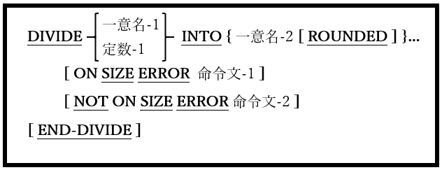

<!--navi start1-->
[前へ](6-14-5.md)/[目次](https://opensourcecobol.github.io/markdown/TOC.html)/[次へ](6-15-2.md)
<!--navi end1-->
## 6.15. DIVIDE

### 6.15.1. DIVIDE文の書き方1 ― DIVIDE INTO

図6-47-DIVIDE INTO構文

指定された値を一つ以上のデータ項目に分割し、それらの各データ項目を一意名-1または定数-1値で割った結果に置き換える。除算の余りは破棄される。

1. 一意名-1および一意名-2は、編集不可の数値データ項目でなければならない。

2. 定数-1は数字定数でなければならない。

3. ON SIZE ERROR、NOT ON SIZE ERROR、およびROUNDED句はコード化されており、ADD文で使われている同名義の句と同様に動作する([6.5](6-5-1.md)を参照)。

4. 一意名-1/定数-1の値がゼロの時、SIZE ERROR条件が発生する。除算の結果、小数点の左側に、受け取り項目で使用可能な数を超える桁数が必要な場合も同様である。

<!--navi start2-->

[ページトップへ](6-15-1.md)
<!--navi end2-->
