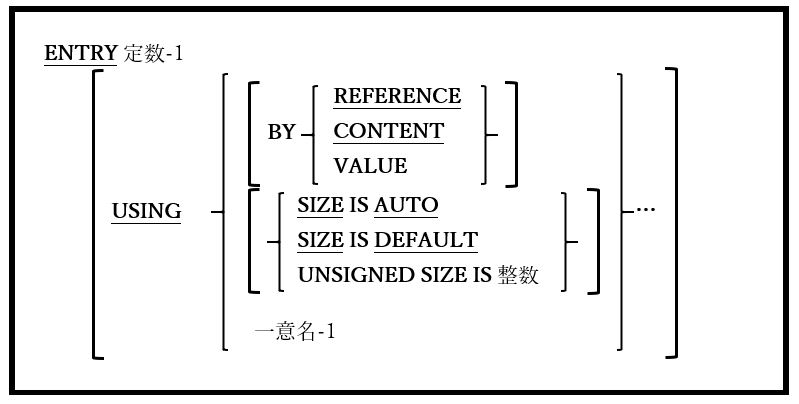

## 6.16. ENTRY

図6-52-ENTRY構文

ENTRY文は、サブルーチンが予期する引数とともに、サブルーチンへの代替記述項ポイントを定義するために使用する。

1. ネストされたサブプログラムでENTRY文を使うことはできない([2.1](2-1.md)を参照)。

2. ENTRY文のUSING句は、サブルーチンを呼び出すCALL文のUSING句と一致する。

3. 定数-1の値によって、サブルーチンの記述項ポイント名を指定する。ENTRY文で指定されているように、(大文字と小文字の使用に関して)CALL文で<u>正確に</u>指定する必要がある。
