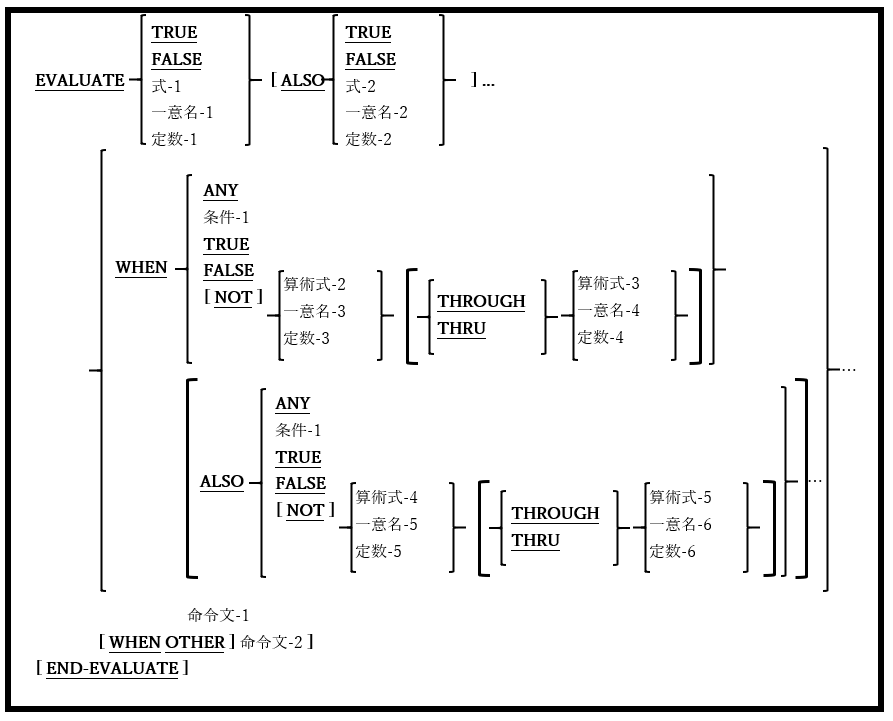

## 6.17. EVALUATE

図6-53-EVALUATE構文

EVALUATE文では、さまざまな状況に合わせて実行する必要がある処理を定義する。

1. 予約語のTHRUとTHROUGHは同意義のものとして扱うことができる。

2. THROUGHを使う場合、THROUGH句に関連する値(算術式-n、一意名-n、および/または定数-n)は同じクラスである必要がある。 例：

                      Legal:                              Not Legal:

        (3 + Years-Of-Service) THROUGH 99      0 THRU “A”

        “A” THRU “Z”                           Last-Name THRU Zip-Code(Assuming Last-Name is 

        X’00’ THRU X’1F’                       PIC X and Zip-Code is PIC 9)

        15.7 THROUGH 19.4

3. EVALUATE文の後、最初のWHEN句の前に指定された値は選択サブジェクトと呼ばれ、各WHEN句の後に指定された値は選択オブジェクトと呼ばれる。

4. 各WHEN句には、EVALUATE文の選択サブジェクトと同じ数の選択オブジェクトが必要である。

5. 各EVALUATE句の選択サブジェクトは、選択オブジェクトに対応する各WHEN句と等しいかどうかテストされる。

6. 5項のテストで等しいと判断され、結果がTRUEである最初のWHEN句では、命令文が実行される。

7. 5項のテストでWHEN句との同等性はなく、結果がTRUEである場合、WHEN OTHER句に関連する命令文(命令文-2)が実行される。WHEN OTHER句がない場合、制御はEVALUATE文に続く次の文へ移る。

8. WHENまたはWHEN OTHER句の命令文が実行されると、制御はEVALUATE文に続く次の文へ移る。

9. ANYの選択オブジェクトを使うと、ANYと一致する選択サブジェクトと自動的に合致する。

ここで、EVALUATE文の利便性がわかる事例を示す。一日の平均残高[ADB]に基づいて口座に支払われる利息を計算するプログラムが開発され、プログラムは以下のように定義されている。

1. 平均残高が1000ドル未満の場合、有利子当座預金口座には利息がつかない。平均残高が1,000ドルから1,499.99ドルの有利子当座預金口座はその1%、1500ドル以上はその1.5％を利子として受け取る。

2. 定期預金口座は、平均残高が10,000ドルまでは1.5%、10,000ドル以上は1.75%の利息が適用される。

3. プラチナ普通預金口座は、平均残高に関係なく2%の利子を受け取る。

4. 上記以外の種類の口座には利子が適用されない。

これらのルールを適用した「EVALUATE」実装をテストするためにopensource COBOLプログラムのサンプルを次に示す。挿入図はプログラムからの出力結果である。

図6-54-EVALUATE文のデモプログラム

