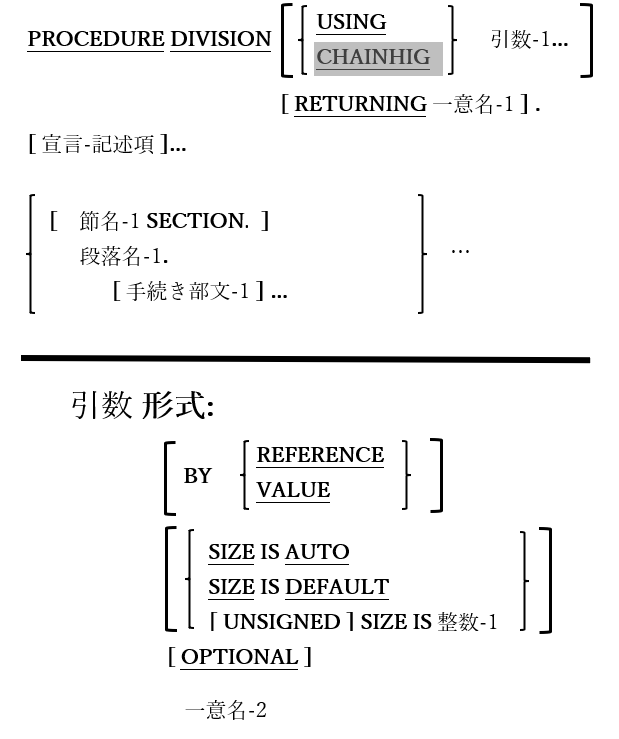

<!--navi start1-->
[前へ](6-1-8-2.md)/[目次](https://opensourcecobol.github.io/markdown/TOC.html)/[次へ](6-3.md)
<!--navi end1-->
## 6.2. 記述形式

図6-16-記述形式構文

手続き部の最初の(オプション)セグメントは、「宣言」と呼ばれる特別な領域となっている。この領域内では、特定のイベントが発生した場合のみ実行される特殊な「トラップ」としての処理ルーチンを定義できる。これについては次の[6.3](6-3.md)で説明する。

手続き型および論理型プログラムが書かれている節や段落は「宣言」に従う。手続き部は独自の節や段落を作成できるCOBOL部門の一つである。

1. USING句とRETURNING句は、サブルーチンとして機能しているプログラムへの引数を定義する。これらの句によって指定されたすべての一意名は、USING句および、またはRETURNING句が表示されるプログラムの連絡節で定義する必要がある。

2. CHAINING句は、CHAIN文を介した他のプログラムによって呼び出されるプログラム内でのみ使うことができる。CHAINING句で指定された一意名は、CHAINING句が表示されるプログラムの連絡節で定義する必要がある。このCHAINING句はopensource COBOLにおいては構文的に使用可能となってはいるが、それ以外では機能しないため、CHAIN文を使おうとした場合は拒否される。

3. ユーザ定義関数(現在opensource COBOLでは使用不可)での使用を目的としているが、RETURNING句は、値が返されるサブプログラムへの引数を指定し、それを文書化する手段として用いることができる。

4. BY REFERENCE句は、プログラムの引数に対応するデータ項目のアドレスがプログラムに渡されることを示す。このプログラムでは、BY REFERENCE引数の内容を変更することができ、BY REFERENCEは、すべてのUSING/CHAINING引数において、BY REFERENCE、BY VALUEが指定されなかったときの既定値である(ここでCHAINING引数は必ずBY REFERENCEでなければならない)。

5. BY VALUE句では、引数に対応する呼び出し側プログラムからのデータ項目の読み込み専用コピーがプログラムに引き渡される。BY VALUE引数の内容は、サブプログラムによって変更することはできない。

6. USING句のメカニズムは、COBOLの一部のメインフレーム実装の場合と同様に、opensource COBOLプログラムがコマンドライン引数を取得することではない。プログラムのコマンドライン引数取得方法については、この後記述するACCEPT文が参考になる。

7. SIZE句は、引き渡された引数のサイズ(バイト単位)を指定し、SIZE IS AUTO句(既定値)では、呼び出し側プログラムの項目サイズに基づいて、引数のサイズが自動で決定される。残りのSIZEオプションでは、特定のサイズを強制的に決定でき、SIZE IS DEFAULTは、UNSIGNED(符号なし) SIZE IS 4と同様のサイズを示す。

<!--navi start2-->

[ページトップへ](6-2.md)
<!--navi end2-->
