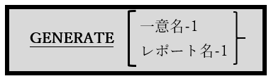

<!--navi start1-->
[前へ](6-19.md)/[目次](https://opensourcecobol.github.io/markdown/TOC.html)/[次へ](6-21.md)
<!--navi end1-->
## 6.20. GENERATE

図6-60-GENERATE構文

GENERATE文は、opensource COBOLコンパイラによって構文的には認識されるが、RWCS(COBOL Report Writer)は現在opensource COBOLでサポートされていないため、機能しない。

<!--navi start2-->

[ページトップへ](6-20.md)
<!--navi end2-->
