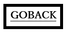

<!--navi start1-->
[前へ](6-20.md)/[目次](https://opensourcecobol.github.io/markdown/TOC.html)/[次へ](6-22-1.md)
<!--navi end1-->
## 6.21. GOBACK

図6-61-GOBACK構文

GOBACK文は、実行中のプログラムを論理的に終了するために使用する。

1. サブルーチン(つまり、CALLされたプログラム)内で実行された場合、GOBACKは制御をCALLに続く文のCALLする側のプログラムに戻す。

2. メインプログラム内で実行された場合、GOBACKはSTOP RUN文として機能する([6.42](6-42.md))。

<!--navi start2-->

[ページトップへ](6-21.md)
<!--navi end2-->
