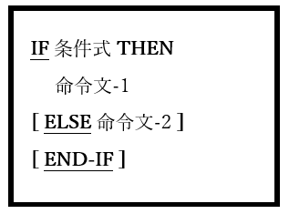

## 6.23. IF

図6-65-IF構文

IF文は、一つの命令文を条件付きで実行するため、または条件式のTRUE / FALSE値に基づいて二つある命令文のうち一つを選択するために使われる。

1. 条件式がTRUEと評価された場合、ELSE句が存在するかどうかに関係なく、命令文-1が実行される。命令文-1が実行されると、制御はEND-IF句に続く最初の文、END-IF句がない場合は命令文に続く最初の文に移る。

2. ELSE句が存在し、条件式-1がFALSEと評価された場合、(その場合にのみ)命令文-2が実行される。命令文-2が実行されると、制御はEND-IF句に続く最初の文、END-IF句がない場合は命令文に続く最初の文に移る。

3. ピリオド(.)とEND-IF文について、IF文の範囲を終了できる方法が互いにどのように類似しているか、または異なっているかを、6.1.5で例を挙げて説明している。
