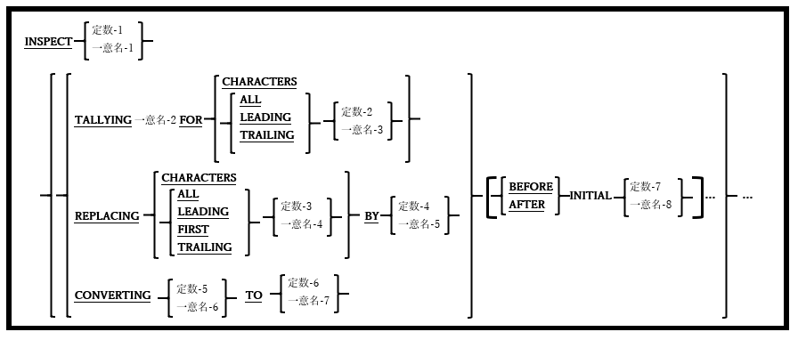

## 6.26. INSPECT

図6-68-INSPECT構文

INSPECT文は、文字列に対してさまざまなカウントまたはデータ変更操作を実行するために使われる。

1. 一意名-1および定数-1は、英数字のUSAGE DISPLAYデータとして明示的または暗黙的に定義する必要があり、この時一意名-1は集団項目の可能性がある。

2. 定数-1を指定すると、REPLACING句またはCONVERTING句が使用できなくなる。

3. 混同や衝突を避けるために、TALLYING、REPLACING、およびCONVERTING句は、コーディングされた順番で実行される。

INSPECT文のルールは、指定された句によって異なる。

**TALLYING句の場合：**

TALLYING句は、一意名-1または定数-1内の文字列数をカウントするために用いられる。

1. 一意名-2は編集不可の数値項目でなければならない。

2. 一意名-3および定数-2は、英数字のUSAGE DISPLAYデータとして明示的または暗黙的に定義する必要があり、この時一意名-3は集団項目の可能性がある。

3. 一意名-2は検索対象のターゲット文字列が一意名-1で見つかるたびに、1ずつ増加する。ターゲット文字列は以下のようになる。

    a. CHARACTERSオプションが使用されている場合は1文字。基本的に合計文字数をカウントする。ALL、すべての LEADING、FIRSTのみまたはすべての TRAILINGの一意名-4 または定数-3 のオカレンス。

    b. ALL、すべての LEADING、FIRSTのみまたはすべての TRAILINGの一意名-3 または定数-2 のオカレンス。

4. 通常は、定数-1または一意名-1の文字列全体がスキャンされる。ただし、この動作はオプションのBEFORE \| AFTER句を用いて変更することができ、スキャン対象の文字列で見つかったデータに基づいて開始点や終了点を指定できる。

5. ターゲット文字列が検出されて一致すると、INSPECT TALLYINGプロセスは検出された文字列の最後から再開される。これにより、対象の文字列を重複してカウントしてしまうことを防ぐことができる。右の例は、「XX」オカレンスを検索するINSPECT TALLYINGのオブジェクトとして使われる値が「XXXXXXXX」である8文字の項目を示す。

    図6-69-INSPECT文TALLYING句の例 
    

    結果として、4つの「XX」オカレンスのみが見つかりました。文字位置2-3、4-5、および6-7も「XX」オカレンスではあるが、他のオカレンスと重複しているためカウントされない

**REPLACING句の場合：**

REPLACING句は、文字列内の部分文字列を、同じ長さで内容の異なるものに置き換えるために用いられる。1つ以上の部分文字列を、長さも内容も異なる他の部分文字列に置き換える必要がある場合は、SUBSTITUTE組み込み関数(6.1.7参照)を使用すると良い。

1. 一意名-4および定数-3は、英数字のUSAGE DISPLAYデータとして明示的または暗黙的に定義する必要があり、この時一意名-4は集団項目の可能性がある。

3. 一意名-5および定数-4は、英数字のUSAGE DISPLAYデータとして明示的または暗黙的に定義する必要があり、この時一意名-5は集団項目の可能性がある。

4. 一意名-4と定数-3、一意名-5と定数-4は同じ長さでなければならない。

5. 「BY」の前に指定された部分文字列は、ターゲット文字列と呼ばれ、「BY」の後に指定された部分文字列は、置換文字列と呼ばれる。

6. ターゲット文字列は次のように識別できる：

    a. CHARACTERSオプションが使用されている場合は、置換文字列の長さと同じ文字順序。

    b. ALL、すべての LEADING、FIRSTのみまたはすべての TRAILINGの一意名-4 または定数-3 のオカレンス。

7. 通常は、一意名-1の文字列全体がスキャンされる。ただし、この動作はオプションのBEFORE \| AFTER句を用いて変更することができ、スキャン対象の文字列で見つかったデータに基づいて開始点や終了点を指定できる。

8. ターゲット文字列が検出されて置き換えられると、INSPECT REPLACINGプロセスは検出された文字列の最後から再開される。これにより、対象の文字列を重複して置き換えてしまうことを防ぐことができ、TALLYINGの場合と非常に似ている。

**CONVERTING句の場合：**

CONVERTING句は、データ項目に対して単アルファベット置換を実行するために用いられる。

1. 一意名-5および定数-6は、英数字のUSAGE DISPLAYデータとして明示的または暗黙的に定義する必要があり、この時一意名-5は集団項目の可能性がある。

2. 一意名-6および定数-7は、英数字のUSAGE DISPLAYデータとして明示的または暗黙的に定義する必要があり、この時一意名-6は集団項目の可能性がある。

3. 一意名-5と定数-6、一意名-6と定数-7は同じ長さでなければならない。

4. 「TO」の前に指定された部分文字列は、ターゲット文字列と呼ばれ、「TO」の後に指定された部分文字列は、置換文字列と呼ばれる。

5. 一意名-1の内容は1文字ずつスキャンされ、その文字がターゲット文字列に該当する場合、(相対位置による)置換文字列内に対応する文字が、一意名-1のその文字を置換する。

6. 置換文字列の長さがターゲット文字列の長さを超える場合、超過分は無視される。

7. ターゲット文字列の長さが置換文字列の長さを超える場合、置換文字列の右側に空白があると見なされてその差が埋められる。

8. INSPECT文は1985年のCOBOL標準で導入されたため、TRANSFORM文(6.47)は廃止された。
