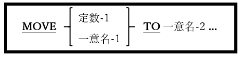

## 6.28. MOVE

### 6.28.1. MOVE文の書き方1 ― MOVE

図6-71-MOVE構文

特定の値を一つ以上の受け取りデータ項目に移動することができる。

1. MOVE文は、一つ以上の受け取りデータ項目(一意名-2･･･)の内容を新しい値に置き換える。

2. 新しい値が各受け取りデータ項目に格納される正確な方法は、各一意名-2項目のPICTUREとUSAGEによって異なる。
