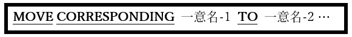

<!--navi start1-->
[前へ](6-28-1.md)/[目次](https://opensourcecobol.github.io/markdown/TOC.html)/[次へ](6-29-1.md)
<!--navi end1-->
### 6.28.2. MOVE文の書き方2 ― MOVE CORRESPONDING

図6-72-MOVE CORRESPONDING構文

同じ名前の基本項目をある集団項目から別の集団項目に移動することができる。

1. CORRESPONDINGという単語は、CORRと省略される場合がある。

2. 一意名-1と一意名-2の両方が集団項目でなければならない。

3. 一意名-1と一意名-2に従属する二つのデータ項目は、次の条件を満たす場合に対応すると言われている：

    a. どちらも同じ名前ではあるがFILLERではない。

    b. 一意名-1と一意名-2に直ちには従属しない場合、上位項目は同じ名前ではあるがFILLERではない。これらの項目が一意名-1と一意名-2でない場合、このルールは一意名-1と一意名-2の構造を通じて再帰的に上位の方に適用されていく。

    c. どちらも基本項目(ADD CORR、SUBTRACT CORR)であるか、少なくとも一つが基本項目(MOVE CORR)である。

    d. 対応する可能性のある候補は、別のデータ項目のREDEFINES句またはRENAMES句ではない。

    e. 対応する可能性のある候補のいずれにもOCCURS句はない(ただしOCCURS句を含む従属データ項目が含まれている場合がある)。

4. 対応するものとの一致が確認できると、MOVE CORRESPONDINGは合致するごとに一つずつ、個々にMOVEが行われたかのように動作する。

この規則は、以下の例題を使うとよく理解できる。

        IDENTIFICATION DIVISION.
        PROGRAM-ID. corrdemo.
        DATA DIVISION.
        WORKING-STORAGE SECTION.
        01  X.
            05 A VALUE 'A' PIC X(1).
            05 G1.
               10 G2.
                  15 B VALUE 'B' PIC X(1).
            05 C.
               10 FILLER VALUE 'C' PIC X(1).
            05 G3.
               10 G4.
                  15 D VALUE 'D' PIC X(1).
            05 V1 VALUE 'E' PIC X(1).
            05 E REDEFINES V1 PIC X(1).
            05 F VALUE 'F' PIC X(1).
            05 G VALUE ALL 'G'.
               10 G2 OCCURS 4 TIMES PIC X(1).
            05 H VALUE ALL 'H' PIC X(4).
        01  Y.
            02 A PIC X(1).
            02 G1.
               03 G2.
                  04 B PIC X(1).
            02 C PIC X(1).
            02 G3.
               03 G5.
                  04 D PIC X(1).
            02 E PIC X(1).
            02 V2 PIC X(1).
            02 G PIC X(4).
            02 H OCCURS 4 TIMES PIC X(1).
            66 F RENAMES V2.
        PROCEDURE DIVISION.
        100-Main.
            MOVE ALL '-' TO Y.
            DISPLAY ' Names: ' 'ABCDEFGGGGHHHH'.
            DISPLAY 'Before: ' Y.
            MOVE CORR X TO Y.
            DISPLAY ' After: ' Y.
            STOP RUN

DISPLAY文で表示される結果は以下の通りである。

        Names: ABCDEFGGGGHHHH
       Before: --------------
        After: ABC---GGGG----

- opensource COBOLでは、「X」および「Y」集団項目内の「A」、「B」、および「C」データ項目間の「対応する」関係を確立している。「X」は 01-05-10-15 のレベル番号付けスキームを使用し、「Y」は 01-02-03-04 を使用しているが、この違いは対応するものの一致が確立することに影響しない。
- G OF X はOCCURS 句を含むデータ項目の親であるが、「G」項目が一致する。
- 「D」項目は3項のbに違反しているため、一致するものはない(4つの集団項目名を注視すること)。
- E OF X は3項のd(REDEFINES)に違反しているため、「E」項目と一致するものはない。
- E OF X は3項のd(RENAMES)に違反しているため、「F」項目と一致するものはない。
- H OF Y にはOCCURS句が含まれており、3項のeに違反しているため、「H」項目と一致するものはない。

<!--navi start2-->

[ページトップへ](6-28-2.md)
<!--navi end2-->
