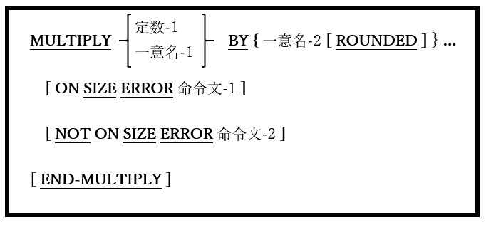

## 6.29. MULTIPLY

### 6.29.1. MULTIPLY文の書き方1 ― MULTIPLY BY

図6-73-MULTIPLY BY構文

算術積を実行する。

1. 一意名-1および一意名-2は、編集不可の数値データ項目でなければならない。

2. 定数-1は数字定数でなければならない。

3. それぞれ一意名-2を掛けた一意名-1またはinteger-1の値が計算され、各計算結果が対応する一意名-2データ項目に移動され、古い内容が置き換えられる。

4. ON SIZE ERROR、NOT ON SIZE ERROR、およびROUNDED句はコード化され、ADD文での同名義句と同様に動作する(6.5参照)。
