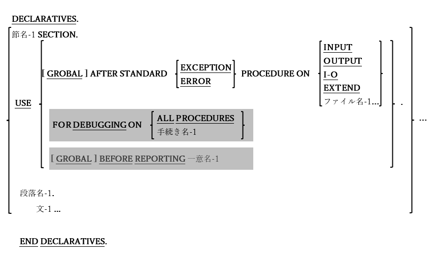

<!--navi start-->
[前へ](6-2.md)/[次へ](6-4-1.md)
<!--navi end-->
## 6.3. 宣言の記述形式

図6-17-宣言構文

プログラマは手続き部の宣言領域内で、プログラム実行時に発生する可能性のある特定のイベントを遮断する、一連の「トラップ」ルーチンを定義することができる。

1. RWCSは現在opensource COBOLにおいてサポートされていないため、USE BEFORE REPORTING句は構文的には認識されても拒否される。

2. USE FOR DEBUGGING句も同様に、構文的に認識されても無視されてしまう。「**-Wall**」または「**-W**」のコンパイラスイッチを使用すると、この機能がまだ実装されていないことを示す警告メッセージが表示される。

3. USE AFTER STANDARD ERROR PROCEDURE句では、指定されたI/Oタイプで(または指定されたファイルに対して)障害が発生したときに呼び出されるルーチンを定義する。

4. GLOBALオプションを使用すると、同じコンパイル単位内のすべてのプログラムにおいて宣言型プロシージャを使用できる。

5. 宣言ルーチン(任意の型)は、PERFORM文を介して参照する場合を除いて、宣言範囲外のプロシージャを参照することはできない。
