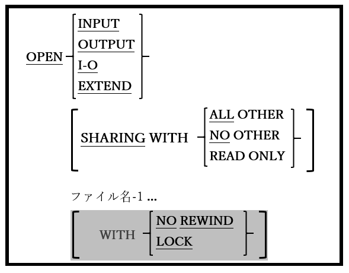

## 6.31. OPEN

図6-76-OPEN構文

OPEN文は、プログラム内の一つ以上のファイルを使用できるようにする。

1. opensource COBOLプログラムで定義されたファイルは、CLOSE文(6.9)、DELETE文(6.13)、READ文(6.33)、START文(6.41)、またはUNLOCK文(6.48)で参照される前に、正常にOPENされている必要がある。更に、ファイルのレコードデータ名(またはレコードに従属するデータ要素)をANY文で参照するためには、ファイルが正常にOPENされていなければならない。

2. 既に開いているファイルを開こうとすると、ファイルステータス41(「ファイルは既に開いています」)で失敗となり、これはプログラムを終了させてしまう致命的なエラーとなる。

3. OPENの失敗(「ファイルは既に開いています」を含む)は、DECLARATIVES(6.3)またはエラープロシージャ(7.3.2)を使って処理できるが、トラップルーチンが終了してしまうと、opensource COBOLランタイムシステムはプログラムを終了し、最終的にOPEN障害から回復することはできない。

4. INPUT、OUTPUT、I-O、およびEXTENDオプションは次のように、ファイルの使用方法をopensource COBOLに通知する。

    | オプション    |  処理   | 
    | --- | --- | 
    | INPUT     | ファイルの既存内容のみを読み取ることができ、CLOSE、READ、START、および UNLOCK 文のみが許可される。 | 
    | OUTPUT    | 新しい内容(ファイルの既存内容が完全に置き換わる場合)のみをファイルに書き込むことができ、CLOSE、UNLOCK、および WRITE 文のみが許可される。| 
    | I-O    | ファイルに対して任意の操作を実行でき、すべてのファイル操作 I/O 文が許可される。| 
    | EXTEND     |  新しい内容(ファイルの既存内容に追加される場合)のみをファイルに書き込むことができ、CLOSE、UNLOCK、および WRITE 文のみが許可される。   | 

5. SHARING句は、同じファイルを開こうとする他のopensource COBOLプログラムと自分のプログラムがどのように共存するかをopensource COBOLに通知する。このオプションについては6.1.9.1で説明している。

6. WITH NO REWIND句とWITH LOCK句は機能しない。

    WITH NO REWIND句をサポートできるデバイス(テープドライブ)は、opensource COBOLが動作する環境では非常に稀であり、コンパイラまたはランタイムメッセージは発行されない(何も実行されない)。

    WITH LOCK句は正式には「実装されていない」ため扱いが少し異なり、コンパイル警告が生成される
