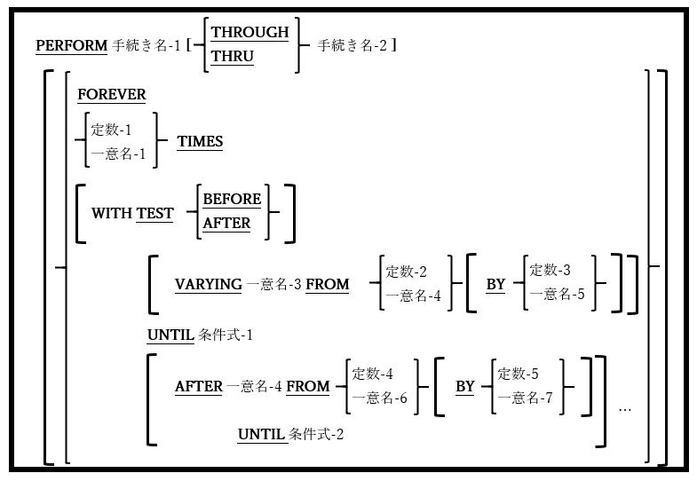
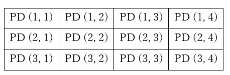
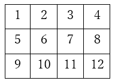
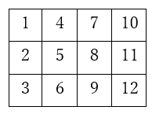

<!--navi start1-->
[前へ](6-31.md)/[目次](https://opensourcecobol.github.io/markdown/TOC.html)/[次へ](6-32-2.md)
<!--navi end1-->
## 6.32. PERFORM

### 6.32.1. PERFORM文の書き方1 ― 手続き型

図6-77-手続き型PERFORM構文



制御を一つ以上のプロシージャに移し、指定されたプロシージャの実行が完了したときに制御を返すために使われる。このプロシージャの呼び出しは、条件がTRUEになるまで、または永久に(おそらくプロシージャ内のPERFORMの制御から抜け出す方法で)、一回、複数回、繰り返し実行できる。

1.	THROUGHとTHRUの単語は、同じ意味を持つものとして使用することができる。

2.	手続き名-1と手続き名-2はどちらも、PERFORM文と同じプログラム単位で定義された手続き部の節または段落でなければならない。

3.	手続き名-2オプションを指定する場合は、プログラムのソースコード内にある手続き名-1に従う必要がある。
4.	PERFORMの範囲は、手続き名-1内の文、手続き名-2内の文、およびこれらの間で定義された全プロシージャ内のすべての文として定義される。

5.	FOREVER、TIMES、またはUNTIL句が存在しない場合、PERFORMの範囲内のコードが(一度)実行された後、制御はPERFORMに続く文に移る。

6.	FOREVERオプションは、PERFORM文に繰り返しの終了条件が定義されていない場合、PERFORMの範囲内でコードを繰り返し実行する。プログラムを停止する(STOP RUN)か、PERFORMから抜け出す(EXIT PERFORM)コードをPERFORMの範囲内に含めるのかどうかは、プログラマ次第である。

7.	TIMESオプションは、PERFORMの範囲内で一定回数、指示された実行を繰り返す。指定された回数分の繰り返しが終了すると、制御はPERFORMに続く次の文に移る。

8.	UNTIL句を用いると、PERFORMの範囲内の文を、条件式-1の値がTRUEになるまで繰り返し実行できる。

9.	オプションのWITH TEST句はUNTILが、PERFORM範囲の前に実行されるか、後に実行されるかを制御する。WITH TEST句が指定されていない場合は「BEFORE」が指定されたものとみなす。

10.	オプションのVARYING句を使うと、PERFORMの範囲内で文を実行するたびに一意の数値を持つデータ項目(一意名-3)を定義できる。初め一意名-3はFROM句で指定された値を持つ。反復の終了時に、BY句で定義された値は、条件式-1が評価される前に一意名-3に追加される。BY句が指定されていない場合は「1」が指定されたものとみなす。

11.	VARYING句が使用されている場合は、任意の数だけAFTER句を追加して、二次ループを作成することができる。AFTER句では反復を追加作成し、反復中に増加する追加のデータ項目を定義し、反復を終了するために追加の条件式を定義することができる。機能的には、複数の文をコーディングすることなく、あるPERFORM / VARYING / UNTILを別のPERFORM / VARYING / UNTIL内にネストする基本的な方法である。次の例が参考になるだろう。


    2次元(3行×4列)のテーブルと、テーブルの各要素への添字参照に使用される数値データ項目のペアを定義する次のコードを確認する。

    

    ```
    01  PERFORM-DEMO.
        05 PD-ROW               OCCURS 3 TIMES.
            10 PD-COL           OCCURS 4 TIMES.
                15 PD           PIC X(1).
    01  PD-Col-No               PIC 9 COMP.
    01  PD-Row-No               PIC 9 COMP.
    ```
    

    ルーチン(100-Visit-Each-PD)をPERFORMしたいとする。このルーチンは、上に示した順序で各PDデータ項目に順次にアクセスする。
    PERFORMコードは次の通りである。

    ```
    PERFORM 100-Visit-Each-PD WITH TEST AFTER
        VARYING PD-Row-No FROM 1 BY 1 UNTIL PD-Row-No = 3
            AFTER PD-Col-No FROM 1 BY 1 UNTIL PD-Col-No = 4.
    ```
    

    一方で上に示した順序で各PDにアクセスしたい場合、必要なPERFORMコードは次の通りである。

    ```
    PERFORM 100-Visit-Each-PD WITH TEST AFTER
        VARYING PD-Col-No FROM 1 BY 1 UNTIL PD-Col-No = 4
        VARYING PD-Row-No FROM 1 BY 1 UNTIL PD-Row-No = 3.
    ```

<!--navi start2-->

[ページトップへ](6-32-1.md)
<!--navi end2-->
