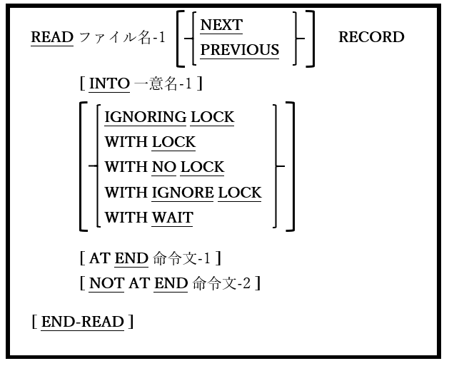

## 6.33. READ

### 6.33.1. READ文の書き方1 ―順次読み取り

図6-79-READ構文(順次読み取り)

ファイルから次の(または前の)レコードを取得する。

1. ファイル名-1は、INPUTまたはI-Oに対して常にOPEN(6.31)である必要がある。

2. ファイル名-1のACCESS MODEがRANDOMの場合、この書き方のREAD文は使用できない。

3. ACCESS MODEがSEQUENTIALの場合、この書き方のREAD文が<u>唯一</u>使用可能となり、NEXT / PRIOR句はオプションとして扱われる。

4. ACCESS MODEがDYNAMICの場合、書き方2と同様にこの書き方のREAD文も使用できる。以下、最小限のREAD文は･･･

    **READ** ファイル名-1

    ･･･正しい書き方として認められる。そのため、ACCESS MODE DYNAMICが指定されていて、上記のような文を<u>順次</u>読み取りとして処理することをopensource COBOLコンパイラに通知する場合は、文にNEXTまたはPRIORを追加する必要がある(そうでない場合は、 <u>ランダム</u>読み取りとして扱われる)。

5. ファイル名-1で次に使用可能なレコードが取得され、その内容はファイルのFD(5.1)に従属する01レベルのレコード構造に格納される。

6. NEXT句およびPREVIOUS句では、読み取りプロセスがどの方向でファイルを通過するかを指定する。どちらも指定されていない場合は、NEXTが指定されているものとみなされる。

7. PREVIOUS句は、ORGANIZATION INDEXEDファイルでのみ使うことができる。

8. INTO句を使うと、読み取りが成功した場合、読み取ったレコード内容がMOVEの規則に従って一意名-1にMOVEされる。

9. レコードのLOCK句については6.1.9.2で説明している。

10. AT END句が存在する場合、ファイルステータスが10「ファイルの終わり」であることが原因でREADの試行が失敗した時に命令文1を実行する。AT END句は、**_ゼロ以外のファイルステータス値を検出しないため、_** DECLARATIVESルーチン(6.3)またはREAD後に明示的に宣言されたファイルステータス項目を使って、ファイルの終わり以外のエラー状態を検出する。

11. NOT AT END句が存在する場合、READの試行が成功すると、命令文2が実行される。
