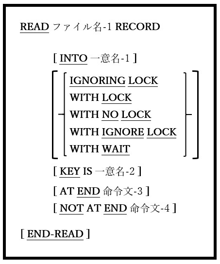

<!--navi start1-->
[前へ](6-33-1.md)/[目次](https://opensourcecobol.github.io/markdown/TOC.html)/[次へ](6-34.md)
<!--navi end1-->
### 6.33.2. READ文の書き方2 ― ランダム読み取り

図6-80-READ構文(ランダム読み取り)



ファイルから任意のレコードを取得する。

1. ファイル名-1は、INPUTまたはI-Oに対して常にOPEN([6.31](6-31.md))である必要がある。

2. ファイル名-1のACCESS MODEがSEQUENTIAL,の場合、この書き方のREAD文は使用できない。

3. ACCESS MODEがRANDOMの場合、この書き方のREAD文が<u>唯一</u>使用可能となる。

4. ACCESS MODEがDYNAMICの場合、書き方2と同様にこの書き方のREAD文も使用できる。以下、最小限のREAD文は･･･
    ```
	READ ファイル名-1
    ```
    ･･･正しい書き方として認められる。そのため、ファイルにACCESS MODE DYNAMICが指定されている場合、上記のようなREAD文は自動的に<u>ランダム</u>読み取りとして扱われる。

5. KEY句は、ファイル内でレコードをどのように配置するかをコンパイラに指示する。

    KEY句がない場合：

    - ファイルがORGANIZATION RELATIVEファイルの場合、ファイルのRELATIVE KEYとして宣言された項目の内容がレコードの識別に使われる。

    - ファイルがORGANIZATION INDEXEDファイルの場合、ファイルのRECORD KEYとして宣言された項目の内容がレコードの識別に使われる。

    KEY句が指定されている場合：

    - ファイルがORGANIZATION RELATIVEファイルの場合、一意名-2の内容が、アクセスされるレコードの相対レコード番号として使われる。一意名-2は、ファイルのRELATIVE KEY項目である必要はない(必要に応じて指定することが可能)。

    - ファイルがORGANIZATION INDEXEDファイルの場合、一意名-2はRECORD KEYまたはファイルのALTERNATE RECORD KEY項目の一つ(存在する場合)である必要があり、その項目の最新の内容によって、アクセスするレコードが識別される。代替レコードキーが使用され、重複値が許可されている場合、アクセスされるレコードは、そのキー値を持つ最初のレコードになる。

6. 5項で識別されるレコードはファイル名-1から取得され、その内容はファイルのFD([5.1](5-1.md#51-ファイル記述))に従属する01レベルのレコード構造に格納される。

7. INTO句を使うと、読み取りが成功した場合、読み取ったレコード内容がMOVEの規則に従って一意名-1にMOVEされる。

8. レコードのLOCK句については[6.1.8.2](6-1-8-2.md)で説明している。

9. INVALID KEY句が存在する場合、ファイルステータスが23「キーが存在しない」であることが原因でREADの試行が失敗した時に命令文1を実行する。INVALID KEY句は、**_ゼロ以外のファイルステータス値を検出しないため、_** DECLARATIVESルーチン([6.3](6-3.md))またはREAD後に明示的に宣言されたファイルステータス項目を使って、「キーが存在しない」以外のエラー状態を検出する。

10. NOT INVALID KEY句が存在する場合、READの試行が成功すると、命令文2が実行される。

<!--navi start2-->

[ページトップへ](6-33-2.md)
<!--navi end2-->
