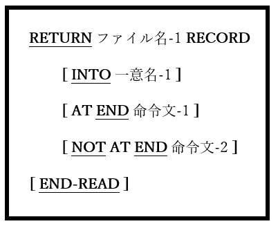

## 6.35. RETURN

図6-82-RETURN構文

RETURN文は、整列ファイルまたはマージファイルからレコードを読み取る。

1. RETURN文は、SORT文(6.40.1)またはMERGE文(6.27)のOUTPUT PROCEDURE内でのみ有効である。

2. ファイル名-1は、ソート記述(SD)記述項で定義された整列ファイルまたはマージファイルでなければならない([5.2](5-2.md)参照)。

3. INTO、AT END、およびNOT AT END句は、READ文(6.33)と同様にして扱われる。
