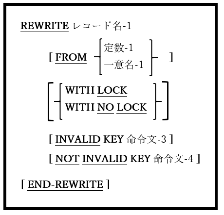

## 6.36. REWRITE

図6-83-REWRITE構文

REWRITE文は、ディスクファイル上の論理レコードを置き換える。

1. レコード名-1は、I-Oに対して現在OPEN(6.31)になっているファイルのファイル記述(FD – 5.1参照)に従属する01レベルのレコードとして定義される必要がある。

2. FROM句を使うと、レコード名-1をファイルに書き込む前に、定数-1または一意名-1が暗黙的にレコード名-1へのMOVEが発生する。

3. REWRITE文は、ORGANIZATION IS LINE SEQUENTIALファイルでは使用できない。

4. レコードのLOCK句については6.1.9.2で説明している。

5. レコードを書き換えても、ファイルの次のブロックが読み取られるか、COMMIT文(6.10)が発行されるか、そのファイルが閉じられるまで、ファイルのレコードの内容は物理的に更新されない。

6. ファイルにORGANIZATION RECORD BINARY SEQUENTIALがある場合：

    a. 書き換えられるレコードは、ファイルの最後に実行されたREAD文(6.33)によって取得されたレコードとなる。
    
    b. レコード名-1のサイズは変更できません(5.1のRECORD CONTAINS / RECORD IS VARYING句を参照)。

7. ファイルにORGANIZATION RELATIVEまたはORGANIZATION INDEXEDがある場合：

    a. ACCESS MODE SEQUENTIALがある場合、書き換えられるレコードは、ファイルの最後に実行されたREAD文(6.33)によって取得されたレコードとなる。ACCESS MODE RANDOMまたはACCESS MODE DYNAMICがある場合、レコードを書き換える前のREAD文は必要ない。ファイルのRELATIVE KEY / RECORD KEY定義で、更新するレコードを指定する。

    b. レコード名-1のサイズは更新される可能性がある。

8. REWRITE文の実行中にエラーが発生した場合、ON INVALID KEY句が実行される(つまり命令文1が実行される)。このようなエラーは、実際のI / Oエラーまたは「キーが存在しない」エラー(ファイルステータス23)である可能性があり、RELATIVE KEYまたはRECORD KEY句の要件を満たすレコードが存在しないことを示す。

9. REWRITE文の実行中にエラーが発生しなかった場合、NOT ON INVALID KEY句が実行され、命令文2が実行される。
