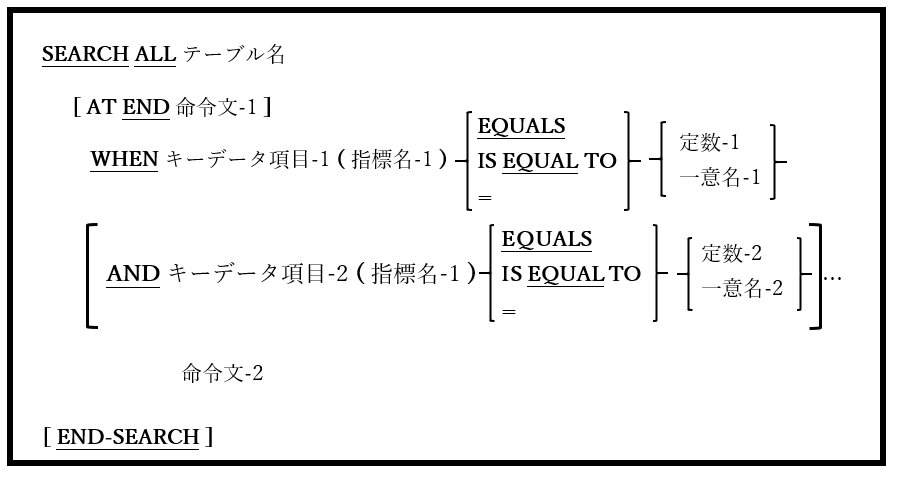

### 6.38.2. SEARCH文の書き方2 ― 二分探索(SEARCH ALL)

図6-86-SEARCH構文(二分探索)

整列されたテーブルに対して二分探索を実行する。

1. テーブル名の定義には、OCCURS、ASCENDING(またはDESCENDING)KEY、そしてINDEXEDBY句を含めなければならない。

2. SEARCH ALL文を介してテーブルを探索できるようにするには、以下の項目が真である必要がある。

    a. テーブルは上記1項の要件を満たしている。

    b. テーブルに一つ以上のKEY句がある時、テーブル内にその順序でデータが並んでいるわけではない。データの順序はKEY句と一致している必要がある。`22`

    c. テーブル内の二つのレコードが同じキー項目値を持つことはできない。また、テーブルに複数のKEY定義がある場合、テーブル内の二つのレコードが同じキー項目値の組み合わせを持つことはできない。

    aに違反した場合、コンパイラはSEARCH ALLを拒否する。bまたはc、あるいはその両方に違反した場合、コンパイラによってメッセージは発行されないが、テーブルに対するSEARCH ALLの実行結果はおそらく正しくない。

3. キーデータ項目-1およびキーデータ項目-2･･･(存在する場合)は、ASCENDING KEY句またはDESCENDING KEY句を介して、テーブル名のキーとして定義する必要がある(上記1項を参照)。

4. 指標名-1は、テーブル名の最初のINDEXED BYデータ項目である。

5. SEARCH文の書き方1とは異なり、WHEN句は<u>必須</u>である。

6. 指定できるWHEN句は一つのみである。AND句の数に制限はないが、キー項目よりWHEN句およびAND句を多く指定することはできない。各WHEN句およびAND句は、異なるキー項目を参照する必要がある。

7. WHEN句の機能は、AND句とともに、最初のINDEXED BY項目によって索引付けされたテーブルのキー項目を指定された定数または一意名の値と比較して、テーブルで目的の記述項を見つけることである。テーブルの索引は最小限のテストを必要とする方法で、SEARCH ALL文によって自動的に変更される。

8. SEARCH ALL文の内部処理は、初めに内部の「最初」および「最後」のポインタを、テーブルの最初と最後の記述項位置に設定し、次のように処理される。`23`

    a. 「最初」と「最後」の中間の記述項が識別される。これを「現在の」記述項と呼び、テーブル記述項の場所が指標名-1に保存されるように設定する。

    b. WHEN句(およびAND句)が評価される。目的の定数または一意名の値とキーを比較すると、次の三つのうちいずれかの結果になる。
        
    - i. キーと値が一致する場合、命令文2が実行された後、制御はSEARCH ALLの次の文に移る。

    - ii.	キーが値よりも小さい場合、検索されるテーブル記述項は、テーブルの「現在」から「最後」の範囲内でのみ発生する可能性があるため、新しい「最初の」ポインタ値が設定される。(この場合「現在の」ポインタとして設定される)。

    - iii. キーが値よりも大きい場合、検索されるテーブル記述項は、テーブルの「最初」から「現在」の範囲内でのみ発生する可能性があるため、新しい「最後の」ポインタ値が設定される(この場合「現在の」ポインタとして設定される)。

    c. 新しい「最初」と「最後」のポインタが、古い「最初」と「最後」のポインタと異なる場合は、さらに検索する必要があるため、手順「a」に戻って検索を続ける。

    d. 新しい「最初」と「最後」のポインタが、古い「最初」と「最後」のポインタと同じである場合、テーブルは使い果たされているため検索されている記述項は見つからない。命令文1が実行された後、制御はSEARCH ALLの次の文に移る。

上記のアルゴリズムの効果は、特定の記述項が存在するかどうかを判断するために、テーブル内のごく一部の要素をテストする必要があることである。これは、SEARCH ALLが記述項をチェックするたび、テーブル内に残っている記述項の半分を破棄するために行われる。

コンピュータ研究者は、二つの探索方法を次のように比較する：

- 順次探索(書き方1)では、記述項を見つけるために平均n / 2回、最悪の場合はn回の探索が必要であり、記述項が存在しないことを示す時もn回の探索が必要となる(n＝テーブル内の記述項の数)。

- 二分探索(書き方2)では、記述項を見つけるために最悪の場合はlog2n回の探索、記述項が存在しないことを示す時でもlog2n回の探索が必要となる(n＝テーブル内の記述項の数)。

探索方法の違いについて、より具体的な考え方がある。テーブルに1,000個の記述項があるとする。順次探索(書き方1)では、平均して500個をチェックして記述項を見つけるか、1,000個全てを調べて記述項が存在しないことを確認する必要がある。二分探索では、記述項の数を2進数(1,00010= 11111010002)で表し、結果の桁数(10)を数える。これは、記述項を探索したり、記述項が存在しないことを確認したりするために必要な探索回数としては<u>最小</u>であり、かなりの改善されている。

---
`22` もちろん、データの順序がKEY句と一致しない場合は、テーブルソートを使って簡単に順序を揃えることができる(SORT文の書き方2 –テーブルソートを参照)。

`23` これは、純粋な教育ツールとして意図されたアルゴリズムを簡略化した考え方であって、実装して機能させるためには、厄介ではあるが詳細を追加する必要がある(ルール「a」で「現在」のエントリが12.5であると識別されたときどうするか等)。
