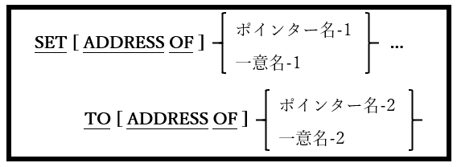

<!--navi start1-->
[前へ](6-39-2.md)/[目次](https://opensourcecobol.github.io/markdown/TOC.html)/[次へ](6-39-4.md)
<!--navi end1-->
### 6.39.3. SET文の書き方3 ― アドレス設定

図6-89-SET構文(アドレス設定)

データ項目の内容ではなく、アドレスを処理するために使われる。

1. TOの<u>前</u>にADDRESS OF句がある場合、SET文を使って連絡節またはBASEDデータ項目のアドレスを変更する。この句がない場合は、一つ以上のUSAGE POINTERデータ項目にアドレスが割り当てられる。

2. TOの<u>後</u>にADDRESS OF句がある場合、一意名-1に割り当てられるアドレス、またはポインター名-1に格納されるアドレスとして、一意名-2のアドレスをSET文が識別する。この句がない場合は、ポインター名-2の内容がアドレスに割り当てられる。

<!--navi start2-->

[ページトップへ](6-39-3.md)
<!--navi end2-->
