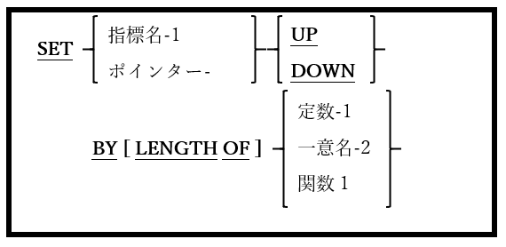

<!--navi start1-->
[前へ](6-39-4.md)/[目次](https://opensourcecobol.github.io/markdown/TOC.html)/[次へ](6-39-6.md)
<!--navi end1-->
### 6.39.5. SET文の書き方5 ― UP/DOWN設定

図6-91-SET構文(UP/DOWN設定)

インデックスまたはポインタの値を指定された値の分だけインクリメントまたはデクリメントするために使われる。

1. 指標名-1はインデックスでなければならない。ポインター-1はポインターまたはプログラムポインターである必要がある。

2. 指標名-1が指定されている場合、<u>一般的に</u>UPまたはDOWNの値を1ずつ設定する。通常指標名-1はテーブルの要素を順番にウォークスルーするために使われる。

<!--navi start2-->

[ページトップへ](6-39-5.md)
<!--navi end2-->
