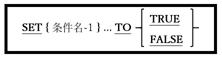

<!--navi start1-->
[前へ](6-39-5.md)/[目次](https://opensourcecobol.github.io/markdown/TOC.html)/[次へ](6-39-7.md)
<!--navi end1-->
### 6.39.6. SET文の書き方6 ― 条件名設定

図6-92-SET構文(条件名設定)

レベル88条件名のTRUE/FALSE値を指定することができる。

1. 指定された条件名をTRUE/FALSE値に設定することで、実際には、条件名データ項目が従属する親データ項目に値を割り当てることになる。

2. TRUEを指定すると、各々の親データ項目に割り当てられる値は、条件名の定義で指定された最初の値になる。

3. SET文でFALSEを指定すると、各々の親データ項目に割り当てられる値は、条件名の定義のFALSE句によって指定された値になる。条件名-1のオカレンスにFALSE句がない場合、SET文はコンパイラによって拒否される。

<!--navi start2-->

[ページトップへ](6-39-6.md)
<!--navi end2-->
