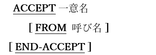

<!--navi start1-->
[前へ](6-3.md)/[目次](https://opensourcecobol.github.io/markdown/TOC.html)/[次へ](6-4-2.md)
<!--navi end1-->
## 6.4. ACCEPT

### 6.4.1. ACCEPT文の書き方1 ― コンソールからの読み取り

図6-18-ACCEPT構文(コンソールからの読み取り)

コンソールウィンドウから値を読み取り、それをデータ項目(一意名)に格納するために使用する。

1. FROM句を使う場合、指定する呼び名はSYSINまたはCONSOLEのいずれかであるか、または、特殊名段落を介してこれら2つのいずれかに割り当てられたユーザ定義の呼び名である必要がある。SYSINとCONSOLEは同じ意味を持つものとして使われ、どちらもコンソールウィンドウを参照する。

2. FROM句が指定されていない場合は、FROM CONSOLEが指定されたとみなす。

<!--navi start2-->

[ページトップへ](6-4-1.md)
<!--navi end2-->
