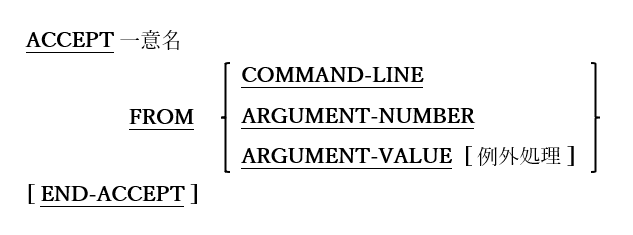

### 6.4.2. ACCEPT文の書き方2 ― コマンドライン引数の取得

図6-19-ACCEPT構文(コマンドライン引数)

プログラムのコマンドラインから引数を取得するために使用する。

1. COMMAND-LINEオプションから受け取ると、プログラムを実行したコマンドラインで入力された全ての引数を、<u>指定した通りに</u>取得できるが、返ってきたデータを意味のある情報に解析する必要がある。

2. ARGUMENT-NUMBERから受け取る場合、コマンドラインから引数を解析し、発見した引数の数を返すようにopensource COBOLランタイムシステムに要求する。 解析は、次のようにオペレーティングシステムのルールに従って実行される。

    - 引数は、文字間の空白を引数間の区切り文字として扱うことで区切られる。2つの空白以外の値を区切る空白の数とは無関係である。

    - 二重引用符(“)で囲まれた文字列は、引用符内に埋め込まれる可能性のある空白の数(空白が存在する場合は)に関係なく、単体の引数として扱われる。

    - Windowsシステムでは、一重引用符またはアポストロフィ文字(‘)は、他のデータ文字と同じように扱われ、文字列を示すことはできない。 

3. ARGUMENT-VALUEから受け取る場合、コマンドラインから引数を解析し、現在のARGUMENT-NUMBERレジスタにある引数を返すようにopensource COBOLランタイムシステムに要求する`17`。解析は、上記の2項で記載したルールに従って実行される。

4. オプションの例外処理の構文と使用法については、6.4.7で説明する。

---
`17` DISPLAY文の書き方2を使って ARGUMENT-NUMBERを目的の値に設定する。
