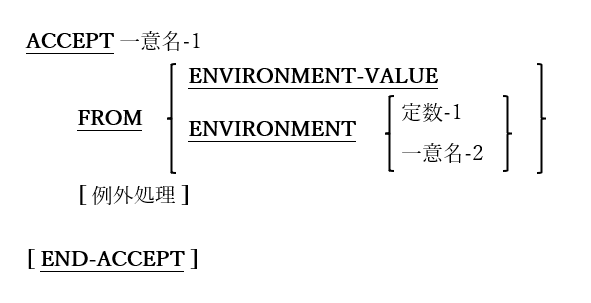

### 6.4.3. ACCEPT文の書き方3 ― 環境変数値の取得

図6-20-ACCEPT構文(環境変数値の取得)

プログラムのコマンドラインから引数を取得するために使用する。

1. ENVIRONMENT-VALUEから受け取る場合、現在のENVIRONMENT-NAMEレジスタにある環境変数の値を取得するようにopensource COBOLランタイムシステムに要求する`18`。

2. 環境変数値を取得する、より簡単なアプローチは「ACCEPT ･･･ FROM ENVIRONMENT」を使うことである。その書き方では、ACCEPTコマンド自体で取得する環境変数を指定する。

3. オプションの例外処理の構文と使用法については、6.4.7で説明する。

---
`18` DISPLAY文の書き方3を使ってENVIRONMENT-NAMEを目的の環境変数名に設定する。
