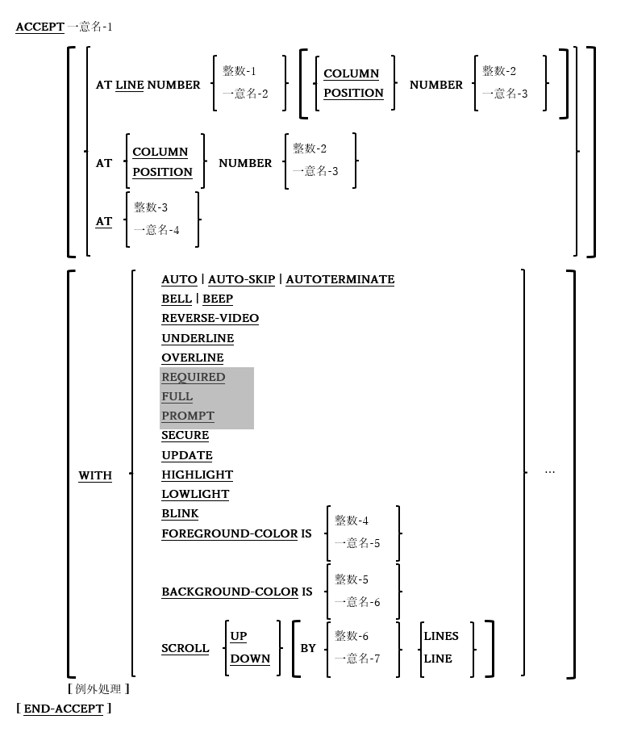

### 6.4.4. ACCEPT文の書き方4 ― 画面データの取得

図6-21-ACCEPT構文(画面データの取得)

画面節で定義されたデータ項目を利用して、形式化されたコンソールウィンドウ画面からデータを取得するために使用する。

1. 一意名-1がSCREEN SECTIONで定義されている場合、すべてのカーソル位置(AT)および属性指定(WITH)はSCREEN SECTION定義から取得され、ACCEPTで指定されたものはすべて無視される。ATおよびWITHオプションは、SCREEN SECTIONで定義されていないデータ項目を受け入れる場合にのみ使う。

2. AT句は、画面が読み取られる前に、カーソルを画面上の特定の場所に配置する手段を提供する。定数-3 /一意名-4の値は4桁である必要があり、最初の2桁はカーソルを配置する行、最後の2桁は列を示す。

3. UPDATEとSCROLLを除いて、ほとんどのWITHオプションについて5.6で説明している。SCROLL以外のWITHオプションは、1回だけ指定する必要がある。

4. UPDATEオプションは、新しい値を受け取る前に一意名-1の現在の内容を表示する句である。

5. SCROLLオプションを使用すると、画面に値が表示される前に、画面上の内容の全体が指定された行数だけ上下にスクロールされる。SCROLL UP句やSCROLL DOWN句を指定することもできる。LINES指定がない場合は「1 LINE」と見なされる。

6. オプションの例外処理の構文と使用法については、6.4.7で説明する。
